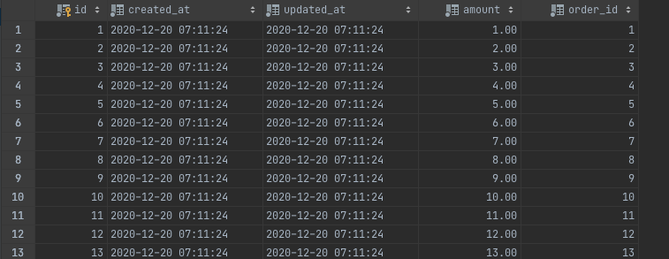

# Spring Batch CSV Reader

Spring Batch를 이용해서 CSV 파일을 읽어 데이터베이스에 저장하는 방법에 대해서 작성해보겠습니다.


## 데이터 흐름

```csv
amount,orderId
1.00,1
2.00,2
3.00,3
4.00,4
5.00,5
6.00,6
7.00,7
8.00,8
9.00,9
10.00,10
11.00,11
12.00,12
13.00,13
14.00,14
15.00,15
16.00,16
17.00,17
```

위 CSV 파일을 읽어 데이터베이스에 저장합니다.

## Batch Code

```kotlin
@Configuration
class CsvReaderJobConfiguration(
    private val jobBuilderFactory: JobBuilderFactory,
    private val stepBuilderFactory: StepBuilderFactory,
    entityManagerFactory: EntityManagerFactory
) {
    private val CHUNK_SZIE = 10

    @Bean
    fun csvReaderJob(
        csvReaderStep: Step
    ): Job = jobBuilderFactory["csvReaderJob"]
        .incrementer(RunIdIncrementer()) // (1)
        .listener(JobReportListener()) // (2)
        .start(csvReaderStep)
        .build()

    @Bean
    @JobScope
    fun csvReaderStep(): Step =
        stepBuilderFactory["csvReaderStep"]
            .chunk<PaymentCsv, Payment>(CHUNK_SZIE) // (3)
            .reader(reader) // (4)
            .processor(processor) // (5)
            .writer(writer) // (6)
            .build()

    private val processor: ItemProcessor<in PaymentCsv, out Payment> =
        ItemProcessor {
            it.toEntity()
        }

    private val reader: FlatFileItemReader<PaymentCsv> =
        FlatFileItemReaderBuilder<PaymentCsv>()
            .name("paymentCsv")
            .resource(ClassPathResource("/payment.csv")) // (7)
            .linesToSkip(1) // (8)
            .delimited()
            .delimiter(DelimitedLineTokenizer.DELIMITER_COMMA) // (9)
            .names("amount", "orderId") // (10)
            .fieldSetMapper { // 11
                PaymentCsv(
                    amount = it.readBigDecimal("amount"),
                    orderId = it.readLong("orderId")
                )
            }
            .build()

    // (12)
    private val writer: JpaItemWriter<Payment> =
        JpaItemWriterBuilder<Payment>()
            .entityManagerFactory(entityManagerFactory)
            .build()
}
```

### Job
* (1): 동일한 job parameter으로 여러 번 job을 실행시켜도 문제없게 `run.id`를 증가시킵니다.
* (3): `csvReaderStep` 해당 step을 실생 시킵니다.

### Step
* (3): chunk size 및, inout, output 클래스 지정합니다.
* (4): `readerPayment` CSV 파일을 라인별로 읽습니다.
* (5): `processor` 읽은 CSV 파일을 Entity POJO 객체를 생성해서 넘겨줍니다.
* (6): `writer` JpaItemWriterBuilder를 이용해서 Enttiy를 데이터베이스에 저장합니다.
* (7): `ClassPathResource`를 이용해서 해당 CSV 파일의 리소스를 지정합니다. classpath 기준으로 `resources/payment.csv`에 위치한 파일을 읽습니다.
* (8): `linesToSkip(1)` 첫 번째 라인은 header로 해당 데이터를 skip 합니다.
* (9): `DelimitedLineTokenizer.DELIMITER_COMMA`은 문자열 `","` 으로 CSV 파일에 대한 구분자 값 문자열을 지정합니다.
* (10): CSV 파일에 필드명을 지정합니다.
* (11): CSV의 DTO객체인 `PaymentCsv`에 어떻게 바인딩 시킬지 지정합니다.
* (12): `entityManagerFactory` 기반으로 해당 엔티티를 영속화 합니다.

## 결과

```
$ ./gradlew bootJar
$ java -jar build/libs/study-0.0.1-SNAPSHOT.jar --job.name=csvReaderJob  
```


해당 데이터가 모두 저장되이 었는것을 확인 할 수 있습니다.
