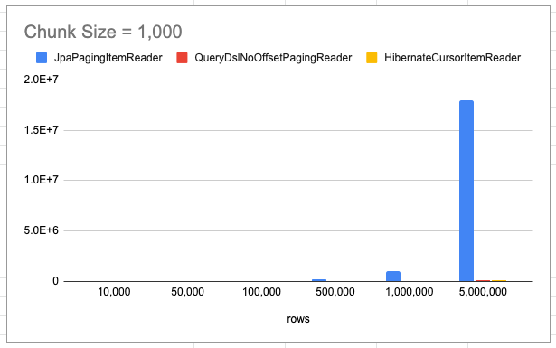

# Spring Batch Reader 성능 분석

* [ ] JpaPaging Reader
* [ ] Zero Offset Reader
* [ ] Cursor Reader
* [ ] JPA 영속성 컨텍스트 초가화 시점은 ?


## Item Reader
데이터 베이스에서 데이터를 읽어 대량의 데이터를 `read`해서 진행하는 경우 성능 적인 차이와, 각 리더의 특징과 어느 부분에서 사용해야하는지에 대해서 정리 해보았습니다.

### 조회 대상

```sql
# created_at 인덱스
CREATE TABLE `payment`
(
    `id`         bigint(20)     NOT NULL AUTO_INCREMENT,
    `amount`     decimal(19, 2) NOT NULL,
    `created_at` datetime       NOT NULL,
    `order_id`   bigint(20)     NOT NULL,
    `updated_at` datetime       NOT NULL,
    PRIMARY KEY (`id`),
    KEY `IDXfxl3u00ue9kdoqelvslc1tj6h` (`created_at`)
) ENGINE = InnoDB
  AUTO_INCREMENT = 1
  DEFAULT CHARSET = utf8mb4
  COLLATE = utf8mb4_unicode_ci
```

가장 최근 데이터 부터 데이터를 읽어 특정 날자까지 데이터를 읽는 기준으로 Item Reader를 작성했습니다.


### 대상 리더
* [JpaPagingItemReader](https://docs.spring.io/spring-batch/docs/current/api/org/springframework/batch/item/database/JpaPagingItemReader.html)
* [QueryDslNoOffsetPagingReader](https://jojoldu.tistory.com/528)
* [JpaCursorItemReader](https://docs.spring.io/spring-batch/docs/current/api/org/springframework/batch/item/database/JpaCursorItemReader.html)

### 성능

### 전체 성능 표
Reader | rows | Chunk Size | 소요 시간(ms)
-------|------|------------|----------
JpaPagingItemReader | 10,000 | 1000 | 778 | 
JpaPagingItemReader | 50,000 | 1000 | 3243 | 
JpaPagingItemReader | 100,000 | 1000 | 8912 | 
JpaPagingItemReader | 500,000 | 1000 | 205469 | 
JpaPagingItemReader | 1,000,000 | 1000 | 1048979
JpaPagingItemReader | 5,000,000 | 1000 | ?
QueryDslNoOffsetPagingReader | 10,000 | 1000 | 658 | 
QueryDslNoOffsetPagingReader | 50,000 | 1000 | 2004 | 
QueryDslNoOffsetPagingReader | 100,000 | 1000 | 3523 | 
QueryDslNoOffsetPagingReader | 500,000 | 1000 | 15501 | 
QueryDslNoOffsetPagingReader | 1,000,000 | 1000 | 28732
QueryDslNoOffsetPagingReader | 5,000,000 | 1000 | 165249
JpaCursorItemReader | 10,000 | 1000 | 448 | 
JpaCursorItemReader | 50,000 | 1000 | 1605 | 
JpaCursorItemReader | 100,000 | 1000 | 2886 | 
JpaCursorItemReader | 500,000 | 1000 | 17411 | 
JpaCursorItemReader | 1,000,000 | 1000 | 25439 | 
JpaCursorItemReader | 5,000,000 | 1000 | 132552

### 성능 그래프





`JpaPagingItemReader` 리더의 시간이 너무 오래 소요되어  `QueryDslNoOffsetPagingReader`, `JpaCursorItemReader` 리더 비교

### 전체 코드

```kotlin
@Configuration
class ReaderPerformanceJobConfiguration(
    private val jobBuilderFactory: JobBuilderFactory,
    private val stepBuilderFactory: StepBuilderFactory
) {
    val log by logger()

    @Bean
    fun readerPerformanceJob(
        jobDataSetUpListener: JobDataSetUpListener,
        readerPerformanceStep: Step
    ) = jobBuilderFactory["readerPerformanceJob"]
            .incrementer(RunIdIncrementer())
            .start(readerPerformanceStep)
            .build()

    @Bean
    @JobScope
    fun readerPerformanceStep(
        jpaCursorItemReader: JpaCursorItemReader<Payment>,
        jpaPagingItemReader: JpaPagingItemReader<Payment>,
        queryDslNoOffsetPagingReader: QuerydslNoOffsetPagingItemReader<Payment>
    ) =
        stepBuilderFactory["readerPerformanceStep"]
            .chunk<Payment, Payment>(CHUNK_SIZE)
// 해당 Reader 중 택 1
//            .reader(jpaCursorItemReader)
//            .reader(jpaPagingItemReader)
//            .reader(queryDslNoOffsetPagingReader)
//            .reader(hibernateCursorItemReader)
//            .reader(queryDslPagingItemReader)
            .writer { log.info("item size ${it.size}") }
            .build()

    @Bean
    @StepScope
    fun jpaPagingItemReader(
        entityManagerFactory: EntityManagerFactory
    ) = JpaPagingItemReaderBuilder<Payment>()
        .name("jpaPagingItemReader")
        .pageSize(CHUNK_SIZE)
        .entityManagerFactory(entityManagerFactory)
        .queryString("SELECT p FROM Payment p where p.createdAt >= :createdAt ORDER BY p.createdAt DESC")
        .parameterValues(mapOf("createdAt" to LocalDateTime.now().withHour(0).withMinute(0).withSecond(0).withNano(0)))
        .build()

    @Bean
    @StepScope
    fun jpaCursorItemReader(
        entityManagerFactory: EntityManagerFactory
    ) = JpaCursorItemReaderBuilder<Payment>()
        .name("jpaCursorItemReader")
        .entityManagerFactory(entityManagerFactory)
        .queryString("SELECT p FROM Payment p where p.createdAt >= :createdAt ORDER BY p.createdAt DESC")
        .parameterValues(mapOf("createdAt" to LocalDateTime.now().withHour(0).withMinute(0).withSecond(0).withNano(0)))
        .build()

    @Bean
    @StepScope
    fun queryDslNoOffsetPagingReader(
        entityManagerFactory: EntityManagerFactory
    ): QuerydslNoOffsetPagingItemReader<Payment> {
        // 1. No Offset Option
        val options = QuerydslNoOffsetNumberOptions<Payment, Long>(qPayment.id, Expression.ASC)
        // 2. Querydsl Reader
        return QuerydslNoOffsetPagingItemReader(entityManagerFactory, CHUNK_SIZE, options) {
            it.selectFrom(qPayment)
                .where(qPayment.createdAt.goe(LocalDateTime.now().withHour(0).withMinute(0).withSecond(0).withNano(0)))
        }
    }
}
```

### JpaPagingItemReader

`JpaPagingItemReader`눈 Spring Batch에서 제공해주는 ItemReader로 일반적인 페이징 방식을 통해서 가져오는 방식입니다. 모든 데이터를 한 번에 가져와서 처리할 수는 없으니 `offset`, `limit` 방식으로 데이터를 가져옵니다. 위 성능표를 보듯이 다른 리더에 비해서 현저하게 느립니다.


그 이유는 블라블ㄹ라라라랄

#### 1 ~ 2 번째 조회
```sql
Hibernate: select payment0_.id as id1_0_, payment0_.amount as amount2_0_, payment0_.created_at as created_3_0_, payment0_.order_id as order_id4_0_, payment0_.updated_at as updated_5_0_ from payment payment0_ where payment0_.created_at>=? order by payment0_.created_at DESC limit ?
2021-05-25 22:40:25.963  INFO 93165 --- [           main] uration$$EnhancerBySpringCGLIB$$d8232fb2 : item size 1000
Hibernate: select payment0_.id as id1_0_, payment0_.amount as amount2_0_, payment0_.created_at as created_3_0_, payment0_.order_id as order_id4_0_, payment0_.updated_at as updated_5_0_ from payment payment0_ where payment0_.created_at>=? order by payment0_.created_at DESC limit ?, ?
2021-05-25 22:40:26.016  INFO 93165 --- [           main] uration$$EnhancerBySpringCGLIB$$d8232fb2 : item size 1000

```
첫 조회 이후 두 번째 조회 까지의 시간은 `26.016 - 25.963 = 0.053` 의 짧은 시간 밖에 걸리지 않았습니다.

#### 49,990,000 ~ 5,000,0000 조회

```
2021-05-31 02:24:27.943  INFO 13475 --- [           main] uration$$EnhancerBySpringCGLIB$$4d92f8c5 : item size 1000
Hibernate: select payment0_.id as id1_0_, payment0_.amount as amount2_0_, payment0_.created_at as created_3_0_, payment0_.order_id as order_id4_0_, payment0_.updated_at as updated_5_0_ from payment payment0_ where payment0_.created_at>=? order by payment0_.created_at DESC limit ?, ?
2021-05-31 02:25:18.092  INFO 13475 --- [           main] uration$$EnhancerBySpringCGLIB$$4d92f8c5 : item size 1000
Hibernate: select payment0_.id as id1_0_, payment0_.amount as amount2_0_, payment0_.created_at as created_3_0_, payment0_.order_id as order_id4_0_, payment0_.updated_at as updated_5_0_ from payment payment0_ where payment0_.created_at>=? order by payment0_.created_at DESC limit ?, ?
```

마지막 청크 사이즈 조회하는 시간은 `25:18.092 - 24:27.943` 대략 51초가 걸렸습니다. 


12 ~ 15


### QueryDslNoOffsetPagingReader


### JpaCursorItemReader


----

## 공부해야할것들
* [ ] index 여부
* [ ] 스트리밍 next


----

```
# 5,000,000
Hibernate: select payment0_.id as id1_0_, payment0_.amount as amount2_0_, payment0_.created_at as created_3_0_, payment0_.order_id as order_id4_0_, payment0_.updated_at as updated_5_0_ from payment payment0_ where payment0_.created_at>=? order by payment0_.created_at DESC limit ?
2021-05-30 18:59:37.307  INFO 13475 --- [           main] uration$$EnhancerBySpringCGLIB$$4d92f8c5 : item size 1000
Hibernate: select payment0_.id as id1_0_, payment0_.amount as amount2_0_, payment0_.created_at as created_3_0_, payment0_.order_id as order_id4_0_, payment0_.updated_at as updated_5_0_ from payment payment0_ where payment0_.created_at>=? order by payment0_.created_at DESC limit ?, ?
2021-05-30 18:59:37.379  INFO 13475 --- [           main] uration$$EnhancerBySpringCGLIB$$4d92f8c5 : item size 1000

--------------
중간...
2021-05-30 22:21:57.532  INFO 13475 --- [           main] uration$$EnhancerBySpringCGLIB$$4d92f8c5 : item size 1000
Hibernate: select payment0_.id as id1_0_, payment0_.amount as amount2_0_, payment0_.created_at as created_3_0_, payment0_.order_id as order_id4_0_, payment0_.updated_at as updated_5_0_ from payment payment0_ where payment0_.created_at>=? order by payment0_.created_at DESC limit ?, ?
2021-05-30 22:22:36.371  INFO 13475 --- [           main] uration$$EnhancerBySpringCGLIB$$4d92f8c5 : item size 1000
Hibernate: select payment0_.id as id1_0_, payment0_.amount as amount2_0_, payment0_.created_at as created_3_0_, payment0_.order_id as order_id4_0_, payment0_.updated_at as updated_5_0_ from payment payment0_ where payment0_.created_at>=? order by payment0_.created_at DESC limit ?, ?


--------

2021-05-31 02:24:27.943  INFO 13475 --- [           main] uration$$EnhancerBySpringCGLIB$$4d92f8c5 : item size 1000
Hibernate: select payment0_.id as id1_0_, payment0_.amount as amount2_0_, payment0_.created_at as created_3_0_, payment0_.order_id as order_id4_0_, payment0_.updated_at as updated_5_0_ from payment payment0_ where payment0_.created_at>=? order by payment0_.created_at DESC limit ?, ?
2021-05-31 02:25:18.092  INFO 13475 --- [           main] uration$$EnhancerBySpringCGLIB$$4d92f8c5 : item size 1000
Hibernate: select payment0_.id as id1_0_, payment0_.amount as amount2_0_, payment0_.created_at as created_3_0_, payment0_.order_id as order_id4_0_, payment0_.updated_at as updated_5_0_ from payment payment0_ where payment0_.created_at>=? order by payment0_.created_at DESC limit ?, ?


-----------
# 5,000,000
```