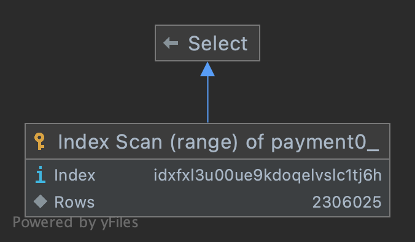
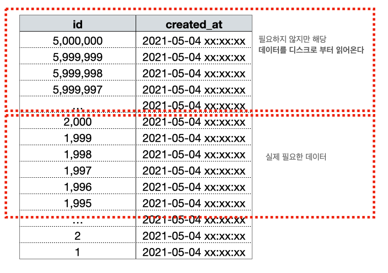
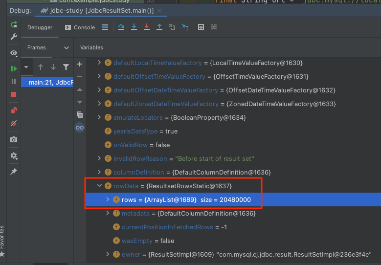
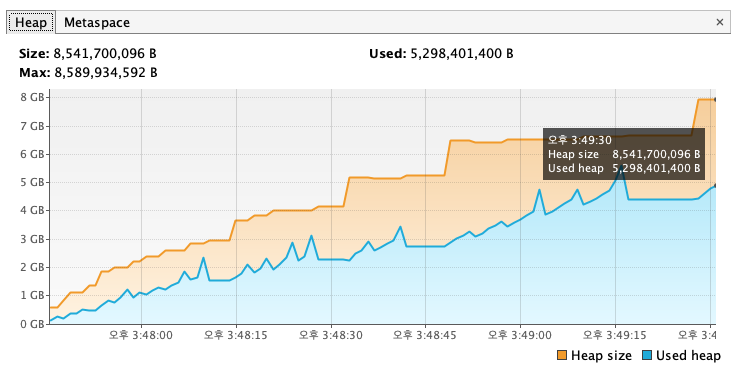
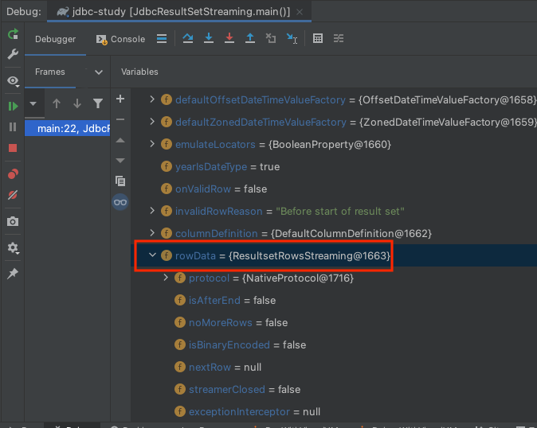
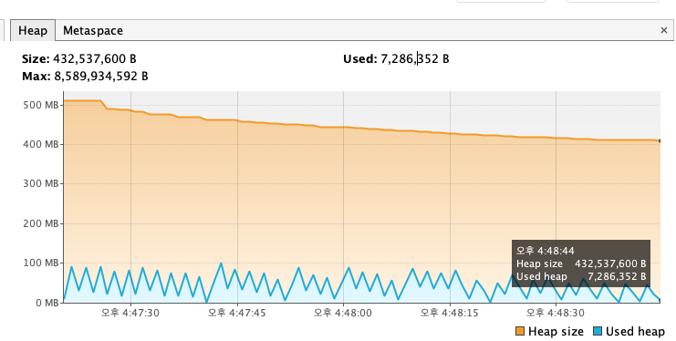
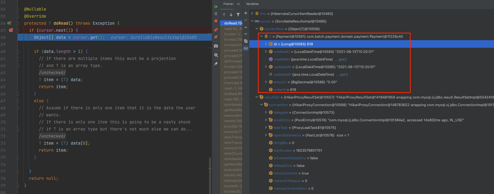

# Spring Batch Reader 성능 분석

스프링 배치 애플리케이션에서 데이터베이스의 대량의 데이터를 처리할 때 Reader에 대한 성능 분석과 성능에 대한 측정을 정리한 포스팅입니다.

## 조회 대상

```sql
# created_at 인덱스
CREATE TABLE `payment`
(
    `id`         bigint(20)     NOT NULL AUTO_INCREMENT,
    `amount`     decimal(19, 2) NOT NULL,
    `created_at` datetime       NOT NULL,
    `order_id`   bigint(20)     NOT NULL,
    `updated_at` datetime       NOT NULL,
    PRIMARY KEY (`id`),
    KEY `IDXfxl3u00ue9kdoqelvslc1tj6h` (`created_at`)
) ENGINE = InnoDB
  AUTO_INCREMENT = 1
  DEFAULT CHARSET = utf8mb4
  COLLATE = utf8mb4_unicode_ci
```

가장 최근 데이터부터 데이터를 읽어 특정 날짜까지 데이터를 읽는 기준으로 Item Reader를 작성했습니다.

## 대상 리더
* [JpaPagingItemReader](https://docs.spring.io/spring-batch/docs/current/api/org/springframework/batch/item/database/JpaPagingItemReader.html)
* [QueryDslNoOffsetPagingReader](https://jojoldu.tistory.com/473?category=902551)
* [HibernateCursorItemReader](https://docs.spring.io/spring-batch/docs/current/reference/html/readersAndWriters.html#JdbcCursorItemReader)

## 성능

### 전체 성능 표
Reader | rows | Chunk Size | 소요 시간(ms)
-------|------|------------|----------
JpaPagingItemReader | 10,000 | 1000 | 778 | 
JpaPagingItemReader | 50,000 | 1000 | 3243 | 
JpaPagingItemReader | 100,000 | 1000 | 8912 | 
JpaPagingItemReader | 500,000 | 1000 | 205469 | 
JpaPagingItemReader | 1,000,000 | 1000 | 1048979
JpaPagingItemReader | 5,000,000 | 1000 | ...
QueryDslNoOffsetPagingReader | 10,000 | 1000 | 658 | 
QueryDslNoOffsetPagingReader | 50,000 | 1000 | 2004 | 
QueryDslNoOffsetPagingReader | 100,000 | 1000 | 3523 | 
QueryDslNoOffsetPagingReader | 500,000 | 1000 | 15501 | 
QueryDslNoOffsetPagingReader | 1,000,000 | 1000 | 28732
QueryDslNoOffsetPagingReader | 5,000,000 | 1000 | 165249
HibernateCursorItemReader | 10,000 | 1000 | 448 | 
HibernateCursorItemReader | 50,000 | 1000 | 1605 | 
HibernateCursorItemReader | 100,000 | 1000 | 2886 | 
HibernateCursorItemReader | 500,000 | 1000 | 17411 | 
HibernateCursorItemReader | 1,000,000 | 1000 | 25439 | 
HibernateCursorItemReader | 5,000,000 | 1000 | 132552

`JpaPagingItemReader`의 rows `5,000,000` 측정은 너무 걸려 측정하지 못했습니다. 대략 5시간 이상까지 측정하다 종료했습니다.

### 성능 그래프


`JpaPagingItemReader` 리더의 시간이 너무 오래 소요되어  `QueryDslNoOffsetPagingReader`, `HibernateCursorItemReader` 리더 비교

## 전체 코드

```kotlin
@Configuration
class ReaderPerformanceJobConfiguration(
    private val jobBuilderFactory: JobBuilderFactory,
    private val stepBuilderFactory: StepBuilderFactory
) {
    val log by logger()

    @Bean
    fun readerPerformanceJob(
        jobDataSetUpListener: JobDataSetUpListener,
        readerPerformanceStep: Step
    ) = jobBuilderFactory["readerPerformanceJob"]
            .incrementer(RunIdIncrementer())
            .start(readerPerformanceStep)
            .build()

    @Bean
    @JobScope
    fun readerPerformanceStep(
        jpaPagingItemReader: JpaPagingItemReader<Payment>,
        hibernateCursorItemReader: HibernateCursorItemReader<Payment>,
        queryDslNoOffsetPagingReader: QuerydslNoOffsetPagingItemReader<Payment>
    ) =
        stepBuilderFactory["readerPerformanceStep"]
            .chunk<Payment, Payment>(CHUNK_SIZE)
// 해당 Reader 중 택 1
//            .reader(jpaPagingItemReader)
//            .reader(queryDslNoOffsetPagingReader)
//            .reader(hibernateCursorItemReader)
            .writer { log.info("item size ${it.size}") }
            .build()

    @Bean
    @StepScope
    fun jpaPagingItemReader(
        entityManagerFactory: EntityManagerFactory
    ) = JpaPagingItemReaderBuilder<Payment>()
        .name("jpaPagingItemReader")
        .pageSize(CHUNK_SIZE)
        .entityManagerFactory(entityManagerFactory)
        .queryString("SELECT p FROM Payment p where p.createdAt >= :createdAt ORDER BY p.createdAt DESC")
        .parameterValues(mapOf("createdAt" to LocalDateTime.now().withHour(0).withMinute(0).withSecond(0).withNano(0)))
        .build()
    
    @Bean
    @StepScope
    fun queryDslNoOffsetPagingReader(
        entityManagerFactory: EntityManagerFactory
    ): QuerydslNoOffsetPagingItemReader<Payment> {
        // 1. No Offset Option
        val options = QuerydslNoOffsetNumberOptions<Payment, Long>(qPayment.id, Expression.ASC)
        // 2. Querydsl Reader
        return QuerydslNoOffsetPagingItemReader(entityManagerFactory, CHUNK_SIZE, options) {
            it.selectFrom(qPayment)
                .where(qPayment.createdAt.goe(LocalDateTime.now().withHour(0).withMinute(0).withSecond(0).withNano(0)))
        }
    }

    @Bean
    @StepScope
    fun hibernateCursorItemReader(
        sessionFactory: SessionFactory
    ) = HibernateCursorItemReaderBuilder<Payment>()
        .name("hibernateCursorItemReader")
        .fetchSize()
        .sessionFactory(sessionFactory)
        .queryString("SELECT p FROM Payment p where p.createdAt >= :createdAt ORDER BY p.createdAt DESC")
        .parameterValues(mapOf("createdAt" to LocalDateTime.now().withHour(0).withMinute(0).withSecond(0).withNano(0)))
        .build()
}
```

## JpaPagingItemReader

`JpaPagingItemReader`눈 Spring Batch에서 제공해 주는 ItemReader로 일반적인 페이징 방식을 통해서 가져오는 방식입니다. 모든 데이터를 한 번에 가져와서 처리할 수는 없으니 `offset`, `limit` 방식으로 데이터를 가져옵니다. 실제 쿼리는 다음과 같습니다.

```sql
select payment0_.id         as id1_0_,
       payment0_.amount     as amount2_0_,
       payment0_.created_at as created_3_0_,
       payment0_.order_id   as order_id4_0_,
       payment0_.updated_at as updated_5_0_
from payment payment0_
where payment0_.created_at >= ?
order by payment0_.created_at DESC
limit ?, ?
```

해당 리더는 위 그래프에서 확인했듯이 다른 리더에 비해서 현저하게 드립니다. **읽어야 할 총 데이터가 많고, 청크 후반으로 갈수록 더욱 느려집니다.**

### 1 ~ 2 번째 조회
```sql
Hibernate: select payment0_.id as id1_0_, payment0_.amount as amount2_0_, payment0_.created_at as created_3_0_, payment0_.order_id as order_id4_0_, payment0_.updated_at as updated_5_0_ from payment payment0_ where payment0_.created_at>=? order by payment0_.created_at DESC limit ?
2021-05-25 22:40:25.963  INFO 93165 --- [           main] uration$$EnhancerBySpringCGLIB$$d8232fb2 : item size 1000
Hibernate: select payment0_.id as id1_0_, payment0_.amount as amount2_0_, payment0_.created_at as created_3_0_, payment0_.order_id as order_id4_0_, payment0_.updated_at as updated_5_0_ from payment payment0_ where payment0_.created_at>=? order by payment0_.created_at DESC limit ?, ?
2021-05-25 22:40:26.016  INFO 93165 --- [           main] uration$$EnhancerBySpringCGLIB$$d8232fb2 : item size 1000

```
첫 조회 이후 두 번째 조회까지의 시간은 `26.016 - 25.963 = 0.053`의 짧은 시간밖에 걸리지 않았습니다.

### 49,990,000 ~ 5,000,0000 조회

```
2021-05-31 02:24:27.943  INFO 13475 --- [           main] uration$$EnhancerBySpringCGLIB$$4d92f8c5 : item size 1000
Hibernate: select payment0_.id as id1_0_, payment0_.amount as amount2_0_, payment0_.created_at as created_3_0_, payment0_.order_id as order_id4_0_, payment0_.updated_at as updated_5_0_ from payment payment0_ where payment0_.created_at>=? order by payment0_.created_at DESC limit ?, ?
2021-05-31 02:25:18.092  INFO 13475 --- [           main] uration$$EnhancerBySpringCGLIB$$4d92f8c5 : item size 1000
Hibernate: select payment0_.id as id1_0_, payment0_.amount as amount2_0_, payment0_.created_at as created_3_0_, payment0_.order_id as order_id4_0_, payment0_.updated_at as updated_5_0_ from payment payment0_ where payment0_.created_at>=? order by payment0_.created_at DESC limit ?, ?
```

마지막 청크 사이즈 조회하는 시간은 `25:18.092 - 24:27.943` 대략 51초가 걸렸습니다. **즉 해당 리더는 초반 청크는 빠르지만 후반으로 갈수록 청크를 읽는 부분이 느려지며, 데이터가 많으면 많을수록 더 느려지는 것을 확인할 수 있습니다.**

### 왜 후반 리드에서 느려지는 것일까?

#### explain: 첫 청크
```sql
explain select payment0_.id         as id1_0_,
       payment0_.amount     as amount2_0_,
       payment0_.created_at as created_3_0_,
       payment0_.order_id   as order_id4_0_,
       payment0_.updated_at as updated_5_0_
from payment payment0_
where payment0_.created_at >= '2021-05-30 00:00:00'
order by payment0_.created_at DESC
limit 1000;
```

| id | select\_type | table | partitions | type | possible\_keys | key | key\_len | ref | rows | filtered | Extra |
| :--- | :--- | :--- | :--- | :--- | :--- | :--- | :--- | :--- | :--- | :--- | :--- |
| 1 | SIMPLE | payment0\_ | NULL | range | IDXfxl3u00ue9kdoqelvslc1tj6h | IDXfxl3u00ue9kdoqelvslc1tj6h | 5 | NULL | 2306025 | 100 | Using index condition |




* `type: range` 인덱스 특정 범위의 행에 접근, 즉 인덱스가 제대로 동작
* `possible_keys: IDXfxl3u00ue9kdoqelvslc1tj6h(created_at)`  이용 가능성 있는 인덱스의 목록
* `key: NULL(created_at)`: `possible_keys`에서 created_at
* `rows: 2306025` 특정 rows을 찾기 위해 읽어야 하는 MySQL 예상 rows, 단 어디까지나 통계 값으로 계산한 값이므로 실제 rows 수와 반드시 일치하지 않는다.
* `filtered: 100` rows 데이터를 가져와 WHERE 구의 검색 조건이 적용되면 몇행이 남는지를 표시, 이 값도 통계 값 바탕으로 계산한 값이므로 현실의 값과 반드시 일치하지 않는다.
* `Extra: Using index condition` 인덱스 컨디션 pushdown(ICP) 최적화가 진행(`Using index`와 비슷한 개념으로 인덱스에서만 접근해서 쿼티를 해결하는 것을 의미, 정확히 알고 있는 개념은 아니라서 [Index Condition Pushdown Optimization](https://dev.mysql.com/doc/refman/5.6/en/index-condition-pushdown-optimization.html)참고)

해당 실행 계획을 정리하면 `created_at` 인덱스가 `type: range`로 제대로 동작했습니다. 하지만 `rows: 2306025`인 것을 봐서 상당히 많은 rows를 읽은 이후에 해당 rows를 찾는 거 같습니다. 대략 `limit 2000000, 1000`까지는 첫 청크 인덱스와 동일하게 `type: range`의 실행 계획을 가졌습니다.

#### explain: 마지막 청크

```sql
explain select payment0_.id         as id1_0_,
       payment0_.amount     as amount2_0_,
       payment0_.created_at as created_3_0_,
       payment0_.order_id   as order_id4_0_,
       payment0_.updated_at as updated_5_0_
from payment payment0_
where payment0_.created_at >= '2021-05-30 00:00:00'
order by payment0_.created_at DESC
limit 4999000, 1000;
```

| id | select\_type | table | partitions | type | possible\_keys | key | key\_len | ref | rows | filtered | Extra |
| :--- | :--- | :--- | :--- | :--- | :--- | :--- | :--- | :--- | :--- | :--- | :--- |
| 1 | SIMPLE | payment0\_ | NULL | ALL | IDXfxl3u00ue9kdoqelvslc1tj6h | NULL | NULL | NULL | 4612051 | 50 | Using where; Using filesort |


* `type: ALL` **풀 스캔, 테이블의 데이터 전체에 접근**
* `key: NULL`: `possible_keys` 필드를 이용하지 않음, 즉 인덱스 사용 안 함
* `Extra`
    * `Using where` **테이블에서 행을 가져온 후 추가적으로 검색 조건을 적용해 행의 범위를 축소**
    * `Using filesort` **ORDER BY 인덱스로 해결하지 못하고, filesort(MySQL의 quick sort)로 행을 정렬**

특정 청크 이후부터는 index를 타지 못하고 풀 스캔이 진행되고 있습니다. 당연히 해당 쿼리는 느릴 수밖에 없습니다.

### 정리



초반 청크에서는 WHERE 조건이 인덱스 칼럼만으로 처리(커버링 인덱스)가 진행돼서 그나마 빠르지만 **후반 청크에서는 페이징 쿼리가 커버링 인덱스로 처리되지 못하게 되고 해당 데이터를 풀 스캔해서 디스크로부터 가져오기 때문에 후반 청크가 느려지게 됩니다.**

## QueryDslNoOffsetPagingReader

QueryDslNoOffsetPagingReader는 [Spring Batch QuerydslItemReader](https://github.com/jojoldu/spring-batch-querydsl) 오픈소스 코드로 자세한 내용은 [기억보단 기록을: Spring Batch와 QuerydslItemReader](https://jojoldu.tistory.com/473?category=902551)에 정리되어 있습니다.

해당 내용을 간단하게 정리하면 다음과 같습니다.

1. `where AND id < 마지막 조회 ID` 조건으로 균일할 리드 속도를 보장
2. 복잡한 정렬 기준이(group by, 집계 쿼리 등등) 있는 경우 사용 불가능
3. 대량의 페이지 조회에 적합 (개인적으로 대략 5만 건 이상의 경우 사용이 적합하다고 생각합니다.)

### explain: 첫 청크

```sql
explain
select payment0_.id         as id1_0_,
       payment0_.amount     as amount2_0_,
       payment0_.created_at as created_3_0_,
       payment0_.order_id   as order_id4_0_,
       payment0_.updated_at as updated_5_0_
from payment payment0_
where payment0_.created_at >= '2021-05-30 00:00:00'
  and payment0_.id >= 1
  and payment0_.id <= 1000
order by payment0_.id asc
limit 1000;
```
| id | select\_type | table | partitions | type | possible\_keys | key | key\_len | ref | rows | filtered | Extra |
| :--- | :--- | :--- | :--- | :--- | :--- | :--- | :--- | :--- | :--- | :--- | :--- |
| 1 | SIMPLE | payment0\_ | NULL | range | PRIMARY,IDXfxl3u00ue9kdoqelvslc1tj6h | PRIMARY | 8 | NULL | 1000 | 50 | Using where |


### explain: 마지막 청크
```sql
explain
select payment0_.id         as id1_0_,
       payment0_.amount     as amount2_0_,
       payment0_.created_at as created_3_0_,
       payment0_.order_id   as order_id4_0_,
       payment0_.updated_at as updated_5_0_
from payment payment0_
where payment0_.created_at >= '2021-05-30 00:00:00'
  and payment0_.id >= 4999001
  and payment0_.id <= 5000000
order by payment0_.id asc
limit 1000;
```

| id | select\_type | table | partitions | type | possible\_keys | key | key\_len | ref | rows | filtered | Extra |
| :--- | :--- | :--- | :--- | :--- | :--- | :--- | :--- | :--- | :--- | :--- | :--- |
| 1 | SIMPLE | payment0\_ | NULL | range | PRIMARY,IDXfxl3u00ue9kdoqelvslc1tj6h | PRIMARY | 8 | NULL | 1000 | 50 | Using where |


* `type: range` 인덱스 특정 범위의 행에 접근, 즉 인덱스가 제대로 동작
* `possible_keys: PRIMARY, IDXfxl3u00ue9kdoqelvslc1tj6h(created_at)`는 `id`, `created_at` 칼럼 인덱스로 사용 가능
* `key: PRIMARY`: `possible_keys` 필드 중 `id`를 인덱스로 사용, InnoDB 테이블에서는 기본적으로 `PRIMARY` 키를 기준으로 클러스터링 되어 저장되기 때문에 실행 계획에서 `PRIMARY` 키는 기본적으로 다른 보조인덱스에 비해 비중이 높게 설정된다.
* `Extra: Using where` **테이블에서 행을 가져온 후 추가적으로 검색 조건을 적용해 행의 범위를 축소**

**첫 청크와 마지막 청크의 실행 계획이 동일한 것을 확인할 수 있습니다. 즉 해당 리더는 청크 사이즈, 데이터 총 rows와 별개로 조회 시간이 균일합니다.**


다음편에 HibernateCursorItemReader 관련 포스팅을 진행하겠습니다.

## HibernateCursorItemReader
HibernateCursorItemReader를 이해하기 앞서 JDBC를 이용하여 대량의 데이터를 가져오는 방에 대해서 이야기해보겠습니다. 이론적인 설명은 [Real MySQL](http://www.yes24.com/Product/Goods/6960931)을 보고 정리했습니다. MySQL를 사용 중이면 정말 추천드리는 도서입니다.

### 대용량 조회 스트리밍 방식
JDBC 표준에서 제공하는 `Statement.setFetchSzie()`를 이용해서 MySQL 서버로부터 SELECT된 레코드를 클라이언트 애플리케이션으로 한 번에 가져올 레코드의 건수를 설정하는 역할을 합니다. **하지만 Connector/J에서 `Statement.setFetchSzie()`의 표준을 지원하지 못하고 있습니다. 즉 Statement.setFetchSzie(100)을 설정해도 100개의 레코드만 가져오게 동작하지는 않습니다.**


**Connector/J를 사용해서 조회 쿼리를 실행하면(Statement.executeQuery()를 이용) 실행하면 Connetor/J가 조회 결과를 MySQL 서버로부터 실행 결과 모두를 다운로드해 Connector/J가 관리하는 캐시메모리에 그 결과를 저장합니다.** 당연히 조회 쿼리의 결과 가를 모두 응답받기 전까지는 Blocking 상태이며 모든 결과를 응답받게 되면 ResultSEt의 핸들러를 애플리케이션에게 반환합니다. 그 이후부터 우리가 일반적으로 사용하는 `ResultSet.next()`, `ResultSet.getSting()`의 호출이 가능하고, **해당 메서드를 호출하면 Connector/J가 캐시 해둔 값으로 빠르게 응답이 가능합니다.(MySQL 서버까지 요청이 가지 않고 Connector/J를 사용한다는 의미)** 이것이 클라이언트 커서라고 하며, 이는 매우 효율적이라서 MySQL Connector/J의 기본 동작으로 채택되어 있습니다.

하지만 이는 문제가 있습니다. 대량의 데이터를 조회할 때 해당 쿼리의 결과가 너무 오래 걸리기 때문에 클라이언트로 다운로드하는 데 많은 시간이 소요되며 **무엇보다도 애플리케이션의 메모리를 한정적이기 때문에 OOM이 발생하기도 합니다.**

### JdbcResultSet

다음 코드는 조회 대상 rows 20,480,000에 대해서 조회하는 코드입니다.

```java
public class JdbcResultSet {

    public static void main(String[] args) throws Exception {
        final Connection connection = (new JdbcResultSet()).getConnection();
        final StopWatch stopWatch = new StopWatch();
        stopWatch.start();

        final String sql = "SELECT *FROM payment WHERE created_at >= '2021-05-01 00:00:00' ORDER BY id ASC";
        final Statement statement = connection.createStatement();
        final ResultSet resultSet = statement.executeQuery(sql);


        while (resultSet.next()) {
            System.out.println("id: " + resultSet.getString("id"));
        }

        resultSet.close();
        statement.close();
        connection.close();

        stopWatch.stop();
        System.out.println(stopWatch.getTotalTimeSeconds());
    }

    public Connection getConnection() throws Exception {
        final String driver = "com.mysql.cj.jdbc.Driver";
        final String url = "jdbc:mysql://localhost:3366/batch_study";
        final String user = "root";
        final String password = "";

        Class.forName(driver).newInstance();
        return DriverManager.getConnection(url, user, password);
    }
}
```


resultSet의 rowData 항목을 디버깅해보고 확인해보면 모든 조회 레코드 rows 20,480,000를 가져온 것을 확인할 수 있습니다. rows의 실제 객체는 ResultsetRowsStatic입니다. 해당 코드의 주석문을 첨부합니다.

> Represents an in-memory result set



위에서도 언급했듯이 **Connector/J를 사용해서 조회 쿼리를 실행하면(Statement.executeQuery()를 이용) 실행하면 Connetor/J가 조회 결과를 MySQL 서버로부터 실행 결과 모두를 다운로드해 Connector/J가 관리하는 캐시메모리에 그 결과를 저장합니다.** Connector/J는 실행 결과 모두를 애플리케이션에 캐시를 하기 때문에 Heap 용량이 max 용량인 8,589,934,592 크기 중 5,298,401,400를 사용하고 있습니다. 현재 애플리케이션의 Heap 사이즈가 8GB이므로 OOM이 발생하지 않았지만, 그보다 낮은 Heap 사이즈에서는 발생할 수 있습니다.

### ResultSetStreaming

이러한 문제를 해결하기 위해서 MySQL에서는 `Statement.setFetchSize()`를 예약된 값인 `Integer.MIN_VALUE`으로 설정하면 한 번에 쿼리의 결과를 모두 다운로드하지 않고 MySQL 서버에서 한 건 단위로 읽어서 가져가게 할 수 있습니다. 이러한 방식을 ResultSet Streaming 방식이라고 합니다.


ResultSetSteaming 방식은 매번 레코드 단위로 MySQL 서버와 통신해야 하므로 Connector/J의 기본적인 처리 방식에 비해서 느리지만 레코드의 **단위가 대량이고 내부적인 애플리케이션의 메모리가 크지 않다면 이 방법을 택할 수밖에 없습니다.** 보다 자세한 내용은 [Connector-J: 6.4 JDBC API Implementation Notes](https://dev.mysql.com/doc/connector-j/8.0/en/connector-j-reference-implementation-notes.html)를 참고해 주세요.

다음 코드도 동일하게 rows 20,480,000에 대해서 조회하는 코드입니다.

```java
public class JdbcResultSetStreaming {

    public static void main(String[] args) throws Exception {
        final Connection connection = (new JdbcResultSetStreaming()).getConnection();
        final StopWatch stopWatch = new StopWatch();
        stopWatch.start();

        final String sql = "SELECT *FROM payment WHERE created_at >= '2021-05-01 00:00:00' ORDER BY created_at DESC";
        final Statement statement = connection.prepareStatement(sql, ResultSet.TYPE_FORWARD_ONLY, ResultSet.CONCUR_READ_ONLY);

        statement.setFetchSize(Integer.MIN_VALUE);
        final ResultSet resultSet = statement.executeQuery(sql);

        while (resultSet.next()) {
           System.out.println("id: " + resultSet.getString("id"));
        }

        resultSet.close();
        statement.close();
        connection.close();

        stopWatch.stop();
        System.out.println(stopWatch.getTotalTimeSeconds());
    }

    public Connection getConnection() throws Exception {
        final String driver = "com.mysql.cj.jdbc.Driver";
        final String url = "jdbc:mysql://localhost:3366/batch_study";
        final String user = "root";
        final String password = "";

        Class.forName(driver).newInstance();
        return DriverManager.getConnection(url, user, password);
    }
}
```
JdbcResultSet 코드와 거의 동일하며 차이점은 `connection.createStatement(...)` 메서드로 Statement를 생성할 때 `ResultSet.CONCUR_READ_ONLY` 설정을 통해서 읽기 전용으로 설정하고, `ResultSet.TYPE_FORWARD_ONLY`으로 Statement 진행 방향을 앞쪽으로 읽을 것을 설정하고 마지막으로 `statement.setFetchSize(Integer.MIN_VALUE);` 설정을 통해 MySQL 서버는 클라이언트가 결과 셋을 레코드 한 건 단위로 다운로드한다고 간주합니다. 이는 예약된 값으로 특별한 의미를 갖는 것이 아니며 100으로 설정한다고 해서 100 건 단위로 가져오지 않습니다.



ResultSetStreaming 방식은 말 그대로 스트리밍 해오는 방식이기 때문에 ResultRowsStreaming 객체를 사용합니다. 스트리밍 하기 때문에 ResultRowsStatic 객체와 다르게 rows를 담지 않습니다. 자세한 설명은 해당 객체의 주석문을 첨부하겠습니다.

> Provides streaming of Resultset rows. Each next row is consumed from the input stream only on next() call. Consumed rows are not cached thus we only stream result sets when they are forward-only, read-only, and the fetch size has been set to Integer.MIN_VALUE (rows are read one by one).
Type parameters:
<T> – ProtocolEntity type

해당 주석에도 `Integer.MIN_VALUE (rows are read one by one).` 한 건으로 가져온다고 나와있습니다.



**Connector/J에서 모든 결과를 캐시하지 않기 때문에 Heap 메모리는 균일한것 확인할 수 있습니다.**

### HibernateCursorItemReader

다시 본론으로 돌아가서 HibernateCursorItemReader에 대해서 설명드리겠습니다. HibernateCursorItemReader는 ResultSetStreaming 방식을 사용합니다. HibernateCursorItemReader의 doRead 코드를 break point를 찍고 보면 다음과 같습니다.



`cursor.get();`를 통해서 가져온 currentRow 데이터가 1개인 것을 확인할 수 있습니다. 이는 ResultSetStreaming 방식과 동일하게 한건 한건 가져오는 방식과 동일합니다.


Heap 사이즈를 보면 위에서 확인했던 ResultSetStreaming Heap 사이즈와 비슷한 그래프를 확인할 수 있습니다. 그리고 `fetchSize` 옵션에 대해 약간 오해가 소지가 있을 수 있습니다.

```kotlin
@Configuration
class ReaderPerformanceJobConfiguration(
    @Bean
    @StepScope
    fun hibernateCursorItemReader(
        sessionFactory: SessionFactory
    ) = HibernateCursorItemReaderBuilder<Payment>()
        .name("hibernateCursorItemReader")
        .fetchSize(10)
        .sessionFactory(sessionFactory)
        .queryString("SELECT p FROM Payment p where p.createdAt >= :createdAt ORDER BY p.createdAt DESC")
        .parameterValues(mapOf("createdAt" to localDateTime))
        .build()

    fun writer() = ItemWriter<Payment> {
        log.info("item size ${it.size}")
    }
}
```
fetchSize를 위처럼 10으로 주면 마치 `Statement.setFetchSzie(10)`이 입력되게 되며 해당 rows 별로 스트리밍 하는 거 같지만 저건 어디까지나 청크 사이즈 개념으로 해당 해당 Reader가 fetchSize 만큼 읽고 나서 Processor or Writer로 넘어가는 사이즈입니다.

> 
> 출처 [Chunk-oriented Processing](https://docs.spring.io/spring-batch/docs/4.0.x/reference/html/index-single.html#chunkOrientedProcessing)


fetchSize를 10으로 설정하면 10단위 Writer으로 넘어 게가 됩니다.

### 주의 사항
한 번 맺은 커넥션으로 계속 스트리밍을 하기 때문에 애플리케이션은 한번 연결한 커넥션을 애플리케이션 종료될 때까지 사용하게 됩니다. 이는 Connection을 반납하지 않는 구조이기 때문에 Connection Timeout이 발생할 수 있기 때문에 조심해야 합니다. 당장은 데이터가 상대적으로 적어서 발생하지 않더라도 데이터가 많아짐에 따라 Connection 시간도 증가하기 때문에 각별히 조심해야 합니다.


## 참고
* [Spring Batch - Reference Documentation](https://docs.spring.io/spring-batch/docs/current/reference/html/index.html)
* [Real MySQL 개발자와 DBA를 위한](http://www.yes24.com/Product/Goods/6960931)
* [MySQL 5.7 완벽 분석 ](http://www.yes24.com/Product/Goods/72270172)
* [기억보단 기록을 - Spring Batch와 QuerydslItemReader](https://jojoldu.tistory.com/473?category=902551)