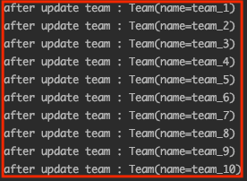
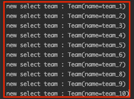

# JPA Bulk 작업시 주의점

JPA Bulk 작업을 진행할 때 영속성 컨텍스트의 매커니즘을 이애하지 못한 상태라면 예상하지 못한 문제를 만날 수도 있게됩니다. 어떤 문제가 있고 이 문제가 왜 발생하는지 정리해 보았습니다.

## 코드
```kotlin
internal class BulkTest(
        private val em: EntityManager
) : SpringBootTestSupport() {

    val query = JPAQueryFactory(em)

    @BeforeEach
    internal fun setUp() {
        val teams = listOf(
                Team("team_1"),
                Team("team_2"),
                Team("team_3"),
                Team("team_4"),
                Team("team_5"),
                Team("team_6"),
                Team("team_7"),
                Team("team_8"),
                Team("team_9"),
                Team("team_10")
        )

        for (team in teams) {
            em.persist(team)
        }

    }

    @Test
    internal fun `bulk test`() {
        // team 전체를 조회한다. team name은 team_x 이다.
        val teams = query.selectFrom(qTeam).fetch()

        for (team in teams) {
            println("before update team : $team")
        }

        val ids = teams.map { it.id!! }

        // team  name 전체를 none name으로 변경한다. 
        val updateCount = query.update(qTeam)
                .set(qTeam.name, "none name")
                .where(qTeam.id.`in`(ids))
                .execute()

        println("update count : $updateCount")

        for (team in teams) {
            println("after update team : $team")
        }

        for (team in newSelectTeams) {
            println("new select team : $team")
        }
    }
}
```

코드는 간단합니다. `team_1`, `team_2`...`team_10`을 저장하고 query dsl update를 이용해서 `team name`을 `none name`으로 변경하는 것입니다. 그리고 변경 제대로 변경이 되었는지 확인 하는 확인 하는 반복문이 있습니다.


로그를 보면 `team name` 1 ~ 10까지 제대로 출력되는 것을 확인 할 수 있습니다.


update query, update count가 정상적으로 출력됩니다. 이제 업데이트된 `team`을 확인 하는 아래 코드의 로그를 확인 해보겠습니다.

```kotlin
for (team in teams) {
    println("after update team : $team")
}
```

예상 했던 `none name`이 아닌 이전 데이터가 출력 되는 것을 획인 할 수 있습니다. 그렇다면 새로 query dsl으로 조회 쿼리를 해보겠습니다.

```kotlin
for (team in newSelectTeams) {
    println("new select team : $team")
}
```


신규로 조회한 데이터에서도 `team name`이 변경되지 않은 것을 확인 할 수 있습니다. 왜 변경되지 않은것일 까요?

## JPA 벌크성 작업은 영속성 컨텍스트와 무관
JPA는 모든 변경사항을 영속성 컨텍스트에서 관리하게 됩니다. 영속성 컨텍스트에서 엔티티를 관리하고 적절한 시점에서 플러시를 발동시켜 영속성 컨텍스트의 데이터와 데이터베이스의 데이터를 동기화 시키게 됩니다.

**하지만**

