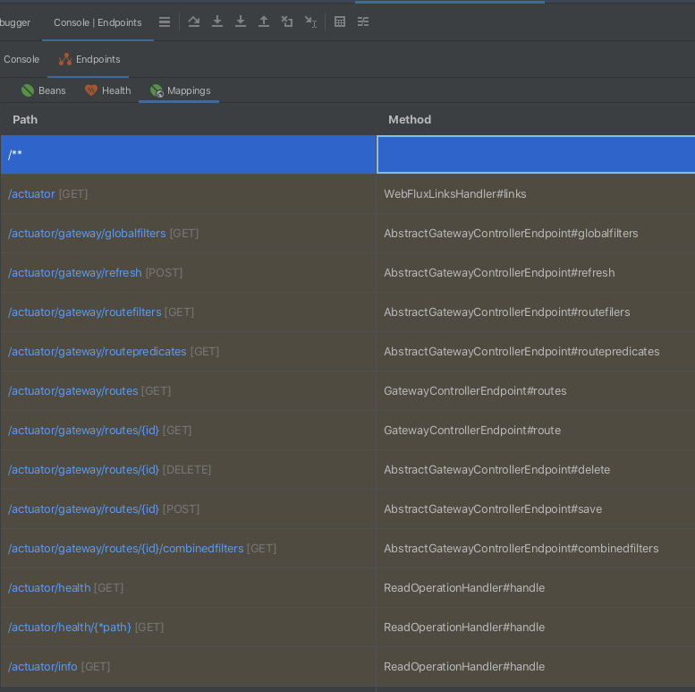

# Spring Cloud Gateway

## 용어

명칭 | 설명
---|---
라우트(Route) | 라우트는 목적지 URI, 조건자 목록과 필터의 목록을 식별하기 위한 고유 ID로 구성된다. 라우트는 모든 조건자가 충족됐을 때만 매칭된다
조건자(Predicates) | 각 요청을 처리하기 전에 실행되는 로직, 헤더와 입력돤값 등 다양한 HTTP 요청이 정의된 기준에 맞는지를 찾는다.
필터(Filters) | HTTP 요청 또는 나가는 HTTP 응답을 수정할 수 있게한다. 다운스트림 요청을 보내기전이나 후에 수정할 수 있다. 라우트 필터는 특정 라우트에 한정된다.

## Getting Started

```
implementation("org.springframework.cloud:spring-cloud-starter-gateway")
implementation("org.springframework.boot:spring-boot-starter-actuator")
```

```kotlin
@SpringBootApplication
class GatewayServerApplication

fun main(args: Array<String>) {
    runApplication<GatewayServerApplication>(*args)
}
```
필요한 의존성만 추가하면 빠르게 Srping Cloud Gateway를 만들 수 있습니다.


### Gateway Route 노출
```yml
management:
    endpoints:
        web:
            exposure:
                include:
                    - "gateway"
    endpoint:
        gateway:
            enabled: true
```
위에서 추가한 `actuator`의존성으로 `gateway`를 노출하면 아래 처럼 url mapping 정보를 확인할 수 있습니다.



현재 아무것도 설정하지 않은 상태이기 때문에 `/actuator/gateway/routes`를 호출하면 아래와 같은 결과를 확인 할 수 있습니다.

```
GET http://127.0.0.1:5555/actuator/gateway/routes

HTTP/1.1 200 OK
transfer-encoding: chunked
Content-Type: application/json

[]

Response code: 200 (OK); Time: 321ms; Content length: 2 bytes
```

### Route 설정

그러면 API를 서버를 하나 새로 만들고 게이트웨이와 연결시켜 보겠습니다.

```yml
    cloud:
        gateway:
            routes:
                -   id: order-service
                    uri: http://localhost:8181
                    predicates:
                        - Path=/order/**
                    filters:
                        - RewritePath=/order/(?<path>.*),/$\{path}
                
                -   id: cart-service
                    uri: http://localhost:8181
                    predicates:
                        - Path=/cart/**
                    filters:
                        - RewritePath=/cart/(?<path>.*),/$\{path}
```
* id: 해당 라우트의 고유 식별자를 나타냅니다.
* uri: 해당 라우터의 주소를 나타냅니다.
* predicates: 해당 라우터의 조건을 작성, `/order/**` 으로 시작하는 요청의 경우 해당 라우터로 요청을 보냄
* filters: 해당 라우터의 필터로, RewritePath는 강제로 Patch를 다시 작성합니다. `/order/orders` -> `/order/orders` 으로 재작성합니다.


### 연결할 API Server

`cart-service`, `order-service` 2 개의 API 서버를 구성합니다. 각 포트의 설정은 `cloud.gateway.routes`에 등록된 포트를 설정합니다.

#### order-service
```kotlin
@RestController
@RequestMapping("/orders")
class OrderApi(
    private val orderRepository: OrderRepository
) {

    @GetMapping
    fun getOrders(pageable: Pageable) = orderRepository.findAll(pageable)
}

@Entity
@Table(name = "orders")
class Order(
    @Column(name = "product_id", nullable = false)
    val productId: Long
) : EntityAuditing() {
    @Column(name = "order_number", nullable = false)
    val orderNumber: String = UUID.randomUUID().toString()
}
```
#### cart-service

```kotlin
@RestController
@RequestMapping("/carts")
class CartApi(
    private val cartRepository: CartRepository
) {
    @GetMapping
    fun getCart(pageable: Pageable) = cartRepository.findAll(pageable)
}

@Entity
@Table(name = "cart")
class Cart(
    @Column(name = "product_id", nullable = false)
    var productId: Long
) : EntityAuditing()
```


* [ ] sleuth
* [ ] gateway
* [ ] A-B test
* [ ] eureka
* [ ] ribbon
* [ ] openfeign
* [ ] weighthigh 


retries: 시도해야하는 재시도 횟수입니다.

statuses: 재 시도해야하는 HTTP 상태 코드로 org.springframework.http.HttpStatus.

methods: 재 시도해야하는 HTTP 메소드로 org.springframework.http.HttpMethod.

series:를 사용하여 표시되는 재 시도 할 일련의 상태 코드 org.springframework.http.HttpStatus.Series입니다.

exceptions: 재 시도해야하는 throw 된 예외 목록입니다.

backoff: 재 시도에 대해 구성된 지수 백 오프입니다. 이 재시의 백 오프 기간 이후에 수행되어 firstBackoff * (factor ^ n), n반복된다. maxBackoff가 구성된 경우 적용되는 최대 백 오프는로 제한됩니다 maxBackoff. 경우 basedOnPreviousValue사실, 백 오프는 byusing 계산됩니다 prevBackoff * factor.

Retry활성화 된 경우 필터에 대해 다음 기본값이 구성 됩니다.

retries: 세 번

series: 5XX 시리즈

methods: GET 메서드

exceptions: IOException및TimeoutException

backoff: 비활성화 됨


## 출처
* [Spring Cloud Gateway  Reference](https://cloud.spring.io/spring-cloud-gateway/reference/html/)