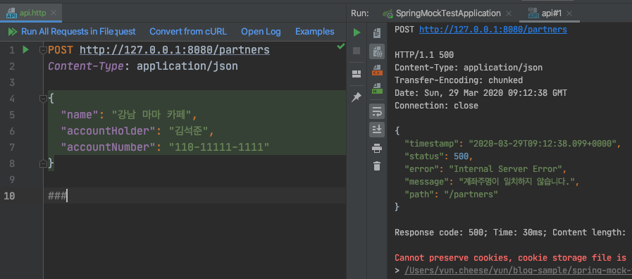

## 외부 인프라 스트럭처 테스트

대부분의 어플리케이션은 외부 인프라스트럭처와 통신하면서 진행됩니다. 대표적인 외부 스트럭처는 외부 API들이 있습니다.

이런 외부 인프라스터럭처는 Mocking 해서 원하는 응답값을 지정하고 검증하고 싶은 부분을 검증을 진행하는 것이 흔한 패턴입니다.

대표적으로 Mockito 프렝미워크가 있으며 Mock 테스트는  [Spring Guide - 테스트 전략 : Service 테스트](https://github.com/cheese10yun/spring-guide/blob/master/docs/test-guide.md#mocktest), [RestTemplate Mock 기반 테스트 하기](https://cheese10yun.github.io/rest-template-mock-test/)에서 포스팅한 적 있습니다.

그런데 이런식의 Mock 테스트는 문제 없지만, 실제 구동 환경(Local, Sandbox, Beta) 에서는 문제가 있을 수 있습니다.

## 요구사항
* 파트너 등록을 진행한다.
* 파트너 등록시 계좌주, 계좌주명 일치 여부를 검증한다.
  * 계좌주 검증은 신한 API를 사용한다.
    * API는 허가된 서버만 호출 할 수 있다.
    * API Call 1건당 비용이 발생한다.
  * 계좌주, 계좌주명 일치 하는 경우 저장한다.
  * 계좌주, 계좌주명 일치하지 않은 경우 예외가 발생한다.

## Code

```kotlin
@RestController
@RequestMapping("/partners")
class PartnerApi(
    private val partnerRegistrationService: PartnerRegistrationService
) {

    @PostMapping
    fun register(@RequestBody @Valid dto: PartnerRegistrationRequest) {
        partnerRegistrationService.register(dto)
    }
}

data class PartnerRegistrationRequest(
    @field:NotEmpty
    val name: String,
    @field:NotEmpty
    val accountHolder: String,
    @field:NotEmpty
    val accountNumber: String
)

@Service
class PartnerRegistrationService(
    private val partnerRepository: PartnerRepository,
    private val bankClient: ShinhanBankClient
) {

    fun register(dto: PartnerRegistrationRequest): Partner {

        // 은행 코드 검증일 진행한다
        bankClient.verifyAccountHolder(
            accountHolder = dto.accountHolder,
            accountNumber = dto.accountHolder
        )

        return partnerRepository.save(Partner(
            accountNumber = dto.accountNumber,
            accountHolder = dto.accountHolder,
            name = dto.name
        ))
    }
}

@Service
class ShinhanBankClient(
    private val shinChanBankApi: ShinChanBankApi
) {

    // 계좌주명, 계좝번호가 일치하지 않으면 예외 발생
    fun verifyAccountHolder(accountNumber: String, accountHolder: String) {
        val response = shinChanBankApi.checkAccountHolder(accountHolder, accountNumber)
        require(!response.matched.not()) { "계좌주명이 일치하지 않습니다." }
    }
}

@Service
class ShinChanBankApi {

    // 계좌주명, 계좌번호가 하드 코딩된 값과 일치여불르 확인한다.
    fun checkAccountHolder(accountHolder: String, accountNumber: String): AccountHolderVerificationResponse {
        return when {
            accountHolder == "yun" && accountNumber == "110-2222-2222" -> AccountHolderVerificationResponse(true)
            else -> AccountHolderVerificationResponse(false)
        }
    }
}

data class AccountHolderVerificationResponse(
    val matched: Boolean
)
```

예제 코드가 길지만 흐름은 간단합니다.
* 파트너 등록 API가 있음
* 파트너 등록시 ShinhanBankClient를 통해서 계좌주 일치 여부를 검증 진행, 일치하지 않은 경우 예외가 발생
  * 일치여부는 하드코딩된 값과 단순 비교를 통해 진행

본 포스팅과는 관련 없는 내용이지만 실제 API Call은 `ShinChanBankApi` 클래스에서 진행하고, 일치하지 않은 경우 예외가 발생하는 비지니스 코드는 `ShinhanBankClient` 클래스에서 진행합니다.

**단순하게 API 통신만 담당하는 객체, API 통신을 담당하는 객체를 이용해서 비지니스 코드를 만드는 객체** 이렇게 객체의 책임과 역할을 명확하게 하고 그 크기를 작게 유지하는 것이 좋은 코드라고 생각합니다.

### Test Code

```kotlin
internal class PartnerApiTest : SpringApiTestSupport() {

    @MockBean
    private lateinit var shinChanBankApi: ShinChanBankApi

    @Test
    internal fun `파트너 등록`() {

        given(shinChanBankApi.checkAccountHolder(anyString(), anyString()))
            .willReturn(AccountHolderVerificationResponse(true))

        mockMvc.post("/partners") {
            contentType = MediaType.APPLICATION_JSON
            content = """
                {
                  "name" : "123",
                  "accountHolder" : "123",
                  "accountNumber" :  "123"
                }
            """.trimIndent()
        }.andExpect {
            status { isOk }
        }
    }
}
```
MockBean을 통해서 가짜 객체를 주입받고 `given()` 메서드를 통해서 일치 한다는 가정을 하고 테스트를 진행하게 됩니다.


해당 테스트는 잘 진행되는 것을 볼 수 있습니다.

## 하지만 문제는 ?



**하지만 문제가 있습니다. 실제 구동 환경(Local, Sandbox, Beta...)에서는 해당 API Call을 진행할 수 없습니다.**

대표적인 이유는 위에서 언급했던 것처럼 아래 처럼 등이 있습니다.
* 사용할 때 마다 비용이 발생
* 허가된 Production 서버만 호출 가능 (Local, Sandbox, Beta 등은 호출 할 수 없음)


위에서 언급한 이유 말고도 많은 이유로 외부 인프라스트럭처를 호출을 진행할 수 엢게 됩니다. 이렇게 되면 테스트 코드를 통한 검증은 가능 하지만, **Local, Sandbox, Beta 등에서는 해당 API를 실제 Call을 해서 성공을 진행할 수 없습니다.**

## 해결 방법
해결 방법은 간단합니다. 