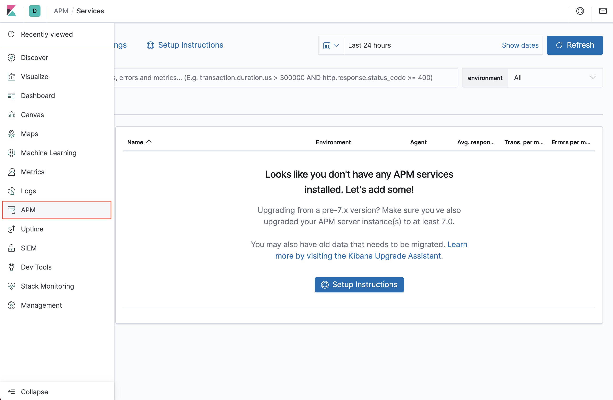
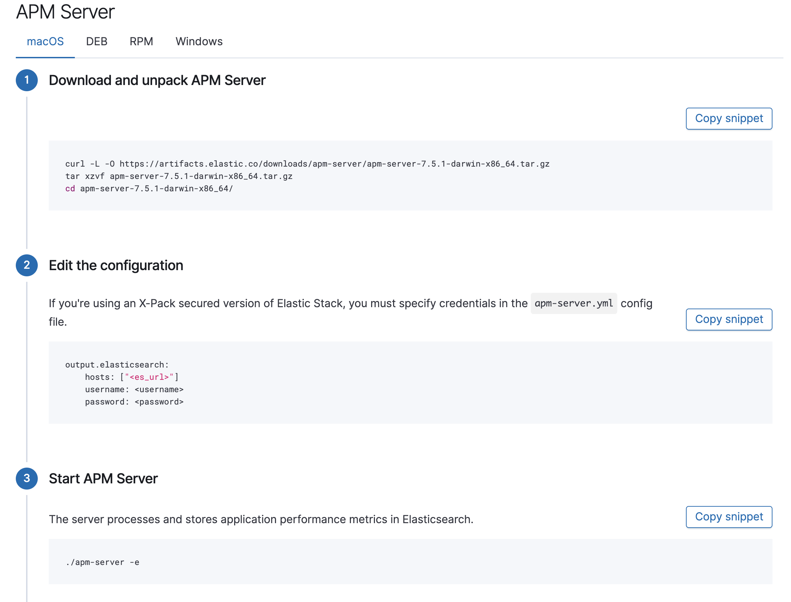
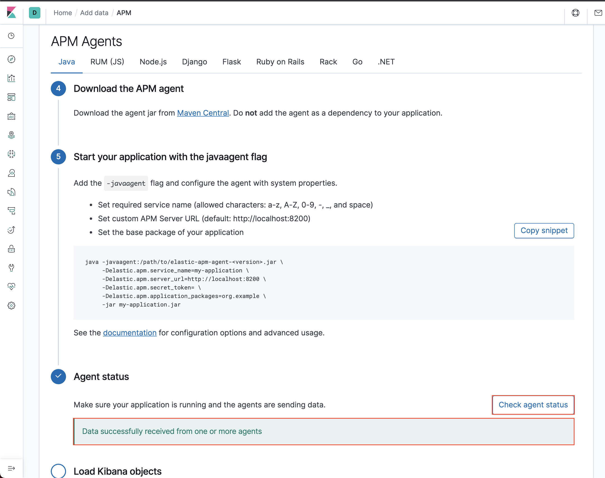
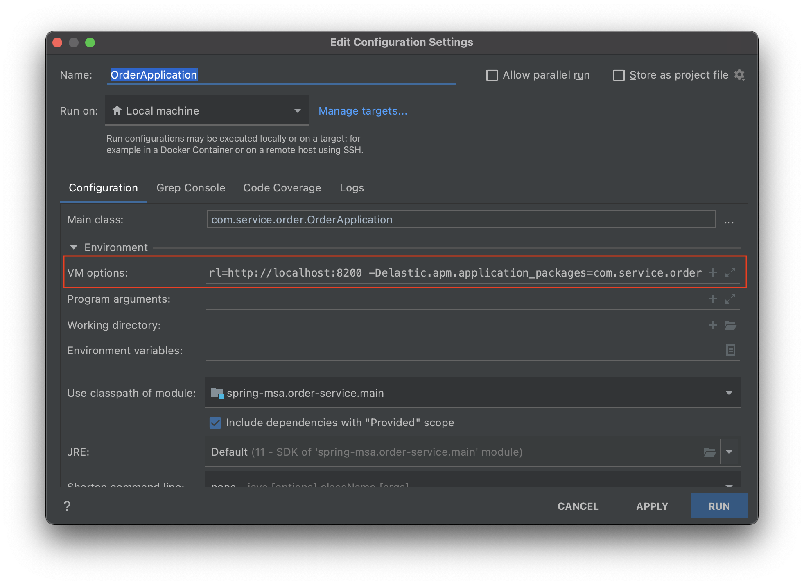
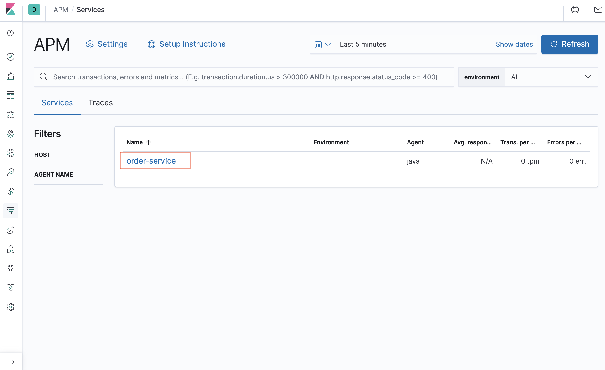
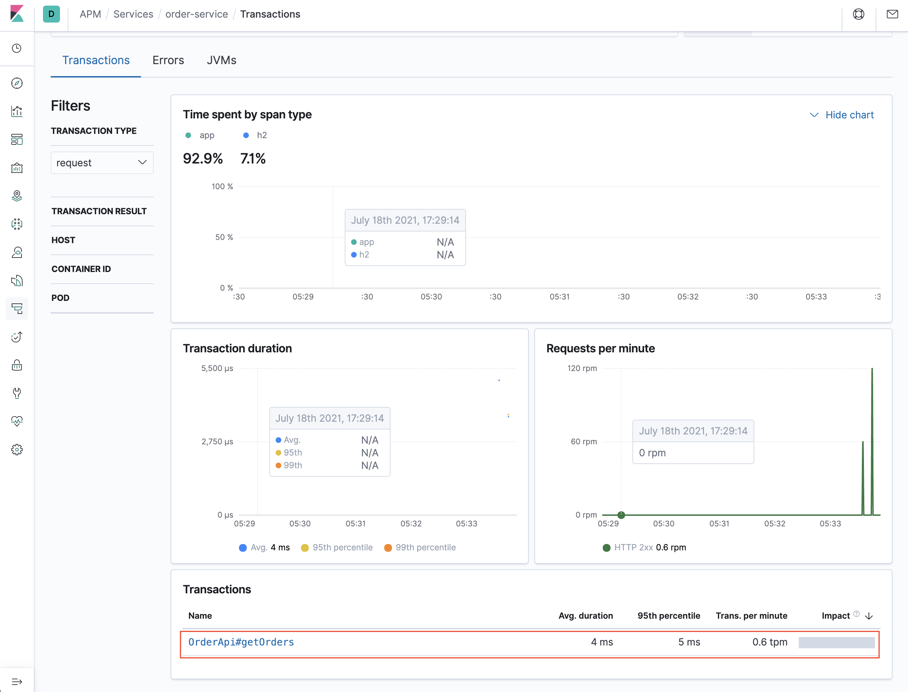
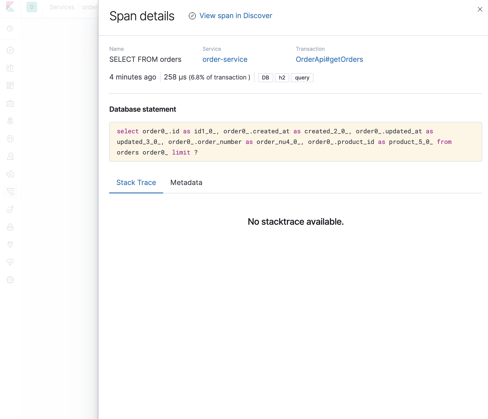
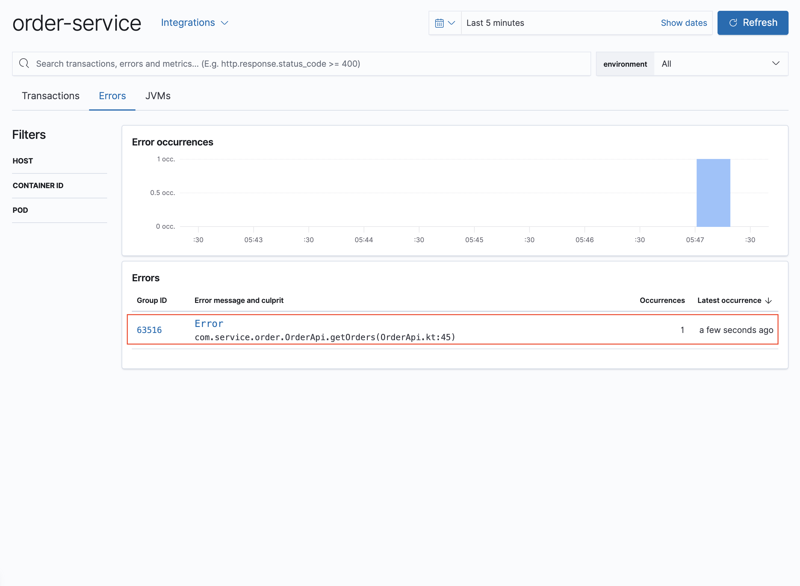
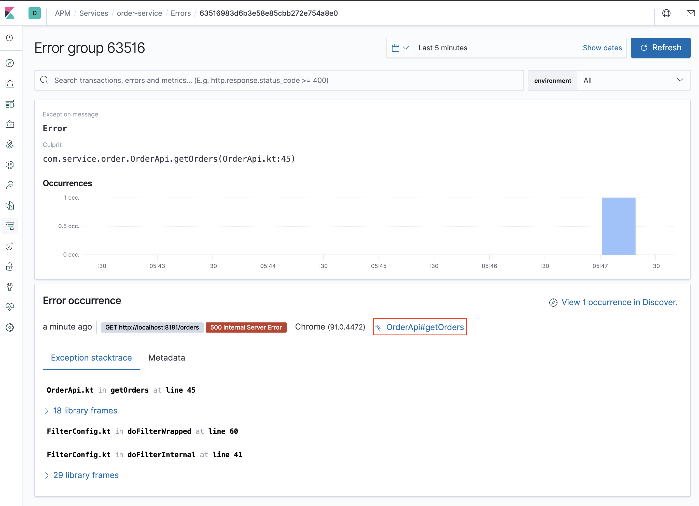

# Elasticsearch : APM 기본설정

Elasticsearch은 모니터링 시스템으로 APM을 지원해주고 있습니다. Spring 기반 웹서버에서 편리하게 구성할 수 있게 Elastic APM Agent를 제공하고 있습니다.

## ELK 구성

```yml
version: '3.2'
services:
    es01:
        image: docker.elastic.co/elasticsearch/elasticsearch:7.5.1
        container_name: es01
        environment:
            - node.name=es01
            - cluster.name=es-docker-cluster
            - discovery.seed_hosts=es02,es03
            - cluster.initial_master_nodes=es01,es02,es03
            - bootstrap.memory_lock=true
            - "ES_JAVA_OPTS=-Xms512m -Xmx512m"
        ulimits:
            memlock:
                soft: -1
                hard: -1
        volumes:
            - ./volume/data01:/usr/share/elasticsearch/data
        ports:
            - 9200:9200
        networks:
            - elastic

    es02:
        image: docker.elastic.co/elasticsearch/elasticsearch:7.5.1
        container_name: es02
        environment:
            - node.name=es02
            - cluster.name=es-docker-cluster
            - discovery.seed_hosts=es01,es03
            - cluster.initial_master_nodes=es01,es02,es03
            - bootstrap.memory_lock=true
            - "ES_JAVA_OPTS=-Xms512m -Xmx512m"
        ulimits:
            memlock:
                soft: -1
                hard: -1
        volumes:
            - ./volume/data02:/usr/share/elasticsearch/data
        ports:
            - 9201:9201
        networks:
            - elastic

    es03:
        image: docker.elastic.co/elasticsearch/elasticsearch:7.5.1
        container_name: es03
        environment:
            - node.name=es03
            - cluster.name=es-docker-cluster
            - discovery.seed_hosts=es01,es02
            - cluster.initial_master_nodes=es01,es02,es03
            - bootstrap.memory_lock=true
            - "ES_JAVA_OPTS=-Xms512m -Xmx512m"
        ulimits:
            memlock:
                soft: -1
                hard: -1
        volumes:
            - ./volume/data03:/usr/share/elasticsearch/data
        ports:
            - 9202:9202
        networks:
            - elastic

    kib01:
        image: docker.elastic.co/kibana/kibana:7.5.1
        container_name: kib01
        ports:
            - 5601:5601
        environment:
            ELASTICSEARCH_URL: http://es01:9200
            ELASTICSEARCH_HOSTS: http://es01:9200
        networks:
            - elastic

    logstash:
        image: docker.elastic.co/logstash/logstash:7.5.1
        container_name: logstash
        command: logstash -f /usr/share/logstash/pipeline/logstash.conf
        volumes:
            -   type: bind
                source: ./logstash/config/logstash.yml
                target: /usr/share/logstash/config/logstash.yml
                read_only: true
            -   type: bind
                source: ./logstash/pipeline
                target: /usr/share/logstash/pipeline
                read_only: true
        environment:
            LS_JAVA_OPTS: "-Xmx256m -Xms256m"
        ports:
            - 5044:5044
        networks:
            - elastic
        depends_on:
            - es01
            - es02
            - es03
            - kib01

volumes:
    data01:
        driver: local
    data02:
        driver: local
    data03:
        driver: local
    logstash:
        driver: local

networks:
    elastic:
        driver: bridge
```

es01, es02, es03각 클러스터링 해서 설절 했고, 키바나 설정과, 로그스테이시 설정을 진행했습니다. 
해당 내용은 [Install Elasticsearch with Docker](https://www.elastic.co/guide/en/elasticsearch/reference/current/docker.html)의 기반으로 로그스테이시 설정을 추가했습니다. 이번 포스팅에서는 사용안하지만 이후 포스팅에 다룰 예정이라 추가했습니다. 로그스테이시 사용하지 않는다면 해당 부분을 주석해서 사용해도 됩니다.

```
$ docmer-compose up -d
```
위 명령어로 도커를 실행합니다.

## APM 설정

### APM Server 설정

* APM 으로 이동합니다


* `Setup Instructions` 버튼을 클릭 합니다.


* 위 가이드 그대로 진행합니다.
  
```
# 해당 파일 다운
curl -L -O https://artifacts.elastic.co/downloads/apm-server/apm-server-7.5.1-darwin-x86_64.tar.gz

# 압축해제
tar xzvf apm-server-7.5.1-darwin-x86_64.tar.gz

# apm-server로 이동
cd apm-server-7.5.1-darwin-x86_64/
```

`apm-server.yml` 설정 파일을 아래 처럼 수정합니다.

```yml
#-------------------------- Elasticsearch output --------------------------
output.elasticsearch:
  # Array of hosts to connect to.
  # Scheme and port can be left out and will be set to the default (`http` and `9200`).
  # In case you specify and additional path, the scheme is required: `http://localhost:9200/path`.
  # IPv6 addresses should always be defined as: `https://[2001:db8::1]:9200`.
  hosts: ["localhost:9200"] # localhost:9200 으로 hosts 지정 
```

### Agent 설정


* Agent 설정도 동일하게 해당 가이드 그대로 진행합니다.
* [Maven Central](https://search.maven.org/artifact/co.elastic.apm/elastic-apm-agent/1.24.0/jar)으로 이동해서 해당 언어에 맞는 Agent를 설치합니다. 해당 서버는 스프링 기반으로 동작하기 때문에 Java로 진행하겠습니다.
* `Check agent status` 버튼을 눌러서 위에서 설정한 APM 서버가 제대로 동작중인지 확인할 수 있습니다.
* 오른쪽 최하단 `Launch APM` 버튼을 클릭해서 종료합니다. 해당 설정으로 다른 무언가를 생성하지 않고 필요한 APM Server, APM Agent를 설정하는 것이 목적입니다.


## Agent 실행

```
java -javaagent:/path/to/elastic-apm-agent-<version>.jar \
     -Delastic.apm.service_name=my-application \
     -Delastic.apm.server_url=http://localhost:8200 \
     -Delastic.apm.secret_token= \
     -Delastic.apm.application_packages=org.example \
     -jar my-application.jar
```
모니터링 대상 서버 구동시 해당 Agent를 같이 실행 하기만 하면 됩니다. 저는 인텔리제이 환경에서 진행하기 때문에 jar를 직접 실행하지 않고 아래처럼 진행했습니다.



```
java -javaagent:/절대 경로/elastic-apm-agent-1.24.0.jar \ 
    -Delastic.apm.service_name=order-service \
    -Delastic.apm.server_url=http://localhost:8200 \
    -Delastic.apm.application_packages=com.service.order
```

* `service_name`: APM 대상의 서버 이름
* `server_url`: 위에서 설정한 APM 서버 주소
* `application_packages`: 애플리케이션 패키지 주소
* `secret_token`: 설정은 사용하지 않아 제거

## 키바나 APM


* 위에 설정한 APM 서버 확인 

### Transactions


* 해당 애플리션의 트랜잭션 정보를 출력합니다. 보다 자세히 보고 싶으면 해당 트랜잭션을 클릭해서 자세한 내용을 확인할 수 있습니다.


* 해당 트랜잭션 내욜을 살펴볼 수 있으며, HTTP 요청/응답에 대한 자세한 내용도 확인 가능합니다.



* 해당 쿼리문의 상세한 내용도 확인할 수 있습니다.


### Errors



* 해당 서버의 Error를 보여줍니다.
* 발생한 Error를 클릭하면 해당 오류의 더 많은 정보를 확인할 수 있습니다.



* 오류가 발생한 트랜잭션을 클릭하면 트래잭션 탭으로 이동되며, 해당 이슈의 원인을 파악을 도와줍니다.

### JVMs


현재 시스템 리소승에 대한 내요을 확인할 수 있습니다.