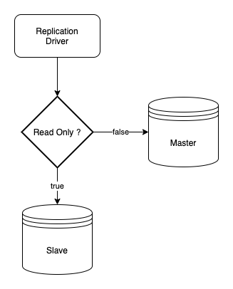
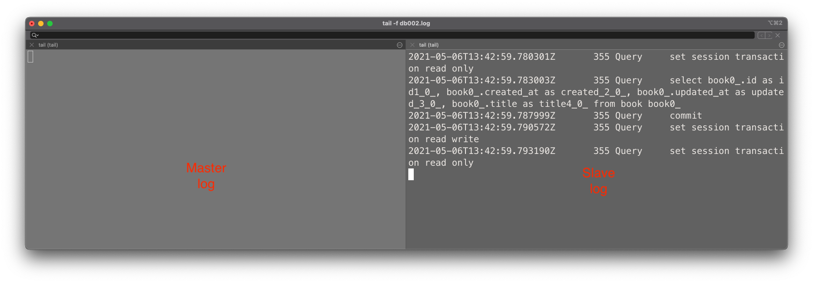
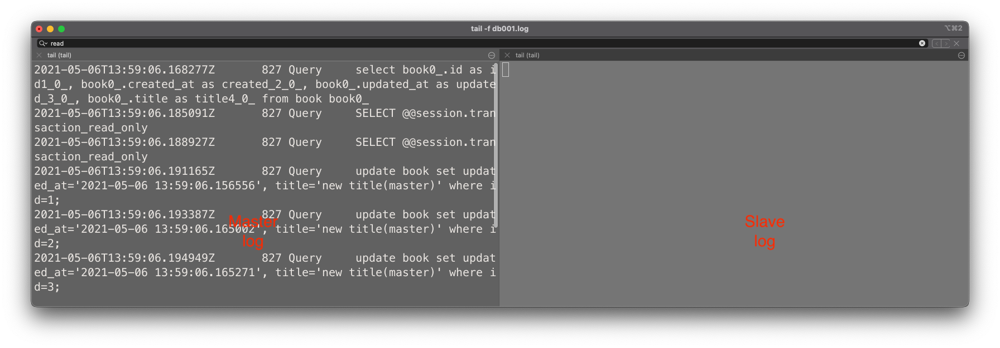

# Spring Master, Slave 트랜잭션 처리 방식

대부분의 서비스에서는 데이터베이스를 Master, Slave 구조로 Master에서는 Create, Update, Delete 업무를 진행하고 Slave에서 Read 업무를 진행하는 구조로 설계합니다. Spring의 Master, Slave 환경에서의 트랜잭션에 대해서 포스팅해보겠습니다.


## Mysql Master, Slave 환경

### Mysql Master, Slave

### RoutingDataSource



트랜잭션에서 `readOnly` 설정을 기준으로 `false` 경우 Master DataSource, `true` 경우 Slave DataSource를 바라보게 설정할 수 있습니다. Master, Slave의 DataSource의 설정은 Spring Boot에서의 순정을 상태를 최대한 이용하려 했습니다. 본 포스팅은 DataSource 코드 구성을 다루는 아니기 때문에 해당 내용은 다른 자료를 보시는 것을 권장드립니다.

```yml
# application.yml
spring:
    datasource:
        initialization-mode: never
        master:
            hikari:
                jdbc-url: jdbc:mysql://localhost:3306/study?useSSL=false&serverTimezone=UTC&autoReconnect=true&rewriteBatchedStatements=true&logger=Slf4JLogger&profileSQL=false&maxQuerySizeToLog=100000
                username: root
                password: root
                driver-class-name: com.mysql.cj.jdbc.Driver

        slave:
            hikari:
                jdbc-url: jdbc:mysql://localhost:3307/study?useSSL=false&serverTimezone=UTC&autoReconnect=true&rewriteBatchedStatements=true&logger=Slf4JLogger&profileSQL=false&maxQuerySizeToLog=100000
                username: root
                password: root
                driver-class-name: com.mysql.cj.jdbc.Driver
```


```kotlin
const val PROPERTIES = "spring.datasource.hikari"
const val MASTER_DATASOURCE = "masterDataSource"
const val SLAVE_DATASOURCE = "slaveDataSource"

@Configuration
class DataSourceConfiguration {

    @Bean(name = [MASTER_DATASOURCE])
    @ConfigurationProperties(prefix = "spring.datasource.master.hikari")
    fun masterDataSource() =
        DataSourceBuilder.create()
            .type(HikariDataSource::class.java)
            .build()

    @Bean(name = [SLAVE_DATASOURCE])
    @ConfigurationProperties("spring.datasource.slave.hikari")
    fun slaveDataSource() =
        DataSourceBuilder.create()
            .type(HikariDataSource::class.java)
            .build()
            .apply { this.isReadOnly = true }

    @Bean
    @DependsOn(MASTER_DATASOURCE, SLAVE_DATASOURCE)
    fun routingDataSource(
        @Qualifier(MASTER_DATASOURCE) masterDataSource: DataSource,
        @Qualifier(SLAVE_DATASOURCE) slaveDataSource: DataSource
    ): DataSource {
        val routingDataSource = RoutingDataSource()
        val dataSources = hashMapOf<Any, Any>()
        dataSources["master"] = masterDataSource
        dataSources["slave"] = slaveDataSource
        routingDataSource.setTargetDataSources(dataSources)
        routingDataSource.setDefaultTargetDataSource(masterDataSource)
        return routingDataSource
    }

    @Primary
    @Bean
    @DependsOn("routingDataSource")
    fun dataSource(routingDataSource: DataSource) =
        LazyConnectionDataSourceProxy(routingDataSource)
}

class RoutingDataSource : AbstractRoutingDataSource() {
    override fun determineCurrentLookupKey(): Any =
        when {
            TransactionSynchronizationManager.isCurrentTransactionReadOnly() -> "slave"
            else -> "master"
        }
}
```

`masterDataSource`, `routingDataSource` DataSource의 Bean을 설정합니다. 각각 3306(Master), 3307(Slave) 포트를 사용하며 해당 디비는 Master, Slave 설정까지 완료되어 있습니다.

`routingDataSource`에서는 `masterDataSource`, `routingDataSource` 데이터 소스를 `master`, `slave`를 HashMap에 저장합니다. `determineCurrentLookupKey` 메서드에서 `readOnly` 설정 여부에 따라 `master`, `slave`의 `DataSource`를 선택하게 됩니다. 

마지막으로 기본 `dataSource` Bean을 생성합니다. 이때 `routingDataSource` Bean을 이용해서 `LazyConnectionDataSourceProxy`를 생성합니다.

### RoutingDataSource 테스트

```kotlin
@RestController
@RequestMapping("/api/book")
class BookApi(
    private val bookRepository: BookRepository
) {

    @GetMapping("/slave")
    @Transactional(readOnly = true)
    fun getSlave() = bookRepository.findAll()

    @GetMapping("/master")
    @Transactional(readOnly = false)
    fun getMaster() = bookRepository.findAll()
}
```

`/api/book"/slave`는 `readOnly = true` 설정으로 Slave를 바라보게 하고, 그와 반대로 `/api/book"/master`는 `readOnly = false`설정으로 Master를 바라보게 설정하고 API 호출 이후 데이터베이스 로그를 확인해보겠습니다.


`readOnly` 여부에 따라서 DataSource가 적절하게 라우팅 되는 것을 확인할 수 있습니다.


## Spring Transaction 테스트

```kotlin
@Component
class AppSetup(
    private val bookRepository: BookRepository
) : ApplicationRunner {

    override fun run(args: ApplicationArguments) {
        bookRepository.saveAll(
            (1..5).map { Book(title = "INIT") }
                .toList()
        )
    }
}
```
Application이 실행될 때 title이 `INIT`으로 데이터를 5개를 생성하는 코드를 추가했습니다. 각 메서드마다 `readOnly` 설정을 다루게 두고 업데이트 작업을 진행하게 됩니다.


### 조회 이후 업데이트

```kotlin
@RestController
@RequestMapping("/api/book")
class BookApi(
    private val bookRepository: BookRepository,
    private val bookService: BookService
) {

    @GetMapping("/update/slave")
    fun startSlave() {
        bookService.updateSlave()
    }
}

@Service
class BookService(
    private val bookRepository: BookRepository
) {

    @Transactional(readOnly = true)
    fun updateSlave() {
        updateTitle("new title(slave)")
    }

    @Transactional(readOnly = false)
    fun updateMaster() {
        updateTitle("new title(master)")
    }

    @Transactional(readOnly = false)
    fun updateTitle(title: String) {
        val books = bookRepository.findAll()
        for (book in books) {
            book.title = title
        }
        bookRepository.saveAll(books)
    }
}
```
* `updateSlave()` 메서드는 `readOnly = true` 시작하고, `updateTitle()` 메서드에서 `readOnly = false`로 진행
* `updateMaster()` 메서드는 `readOnly = false` 시작하고, `updateTitle()` 메서드에서 `readOnly = false`로 진행


#### slave 조회 이후 업데이트



select query가 slave에서 진행된 것을 확인할 수 있습니다. 조회는 `readOnly = true` 설정이지만 title를 업데이트할 때는 `readOnly = false`이기 때문에 영속성 컨텍스트가 flush를 진행하면 해당 내용이 데이터베이스에 반영될 까요? 확인해 보겠습니다.


```
GET http://localhost:8080/api/book/master

HTTP/1.1 200 
Content-Type: application/json
Transfer-Encoding: chunked
Date: Thu, 06 May 2021 13:53:28 GMT
Keep-Alive: timeout=60
Connection: keep-alive

[
  {
    "title": "INIT",
    "id": 1,
    "createdAt": "2021-05-06T22:42:33",
    "updatedAt": "2021-05-06T22:42:33"
  },
  {
    "title": "INIT",
    "id": 2,
    "createdAt": "2021-05-06T22:42:33",
    "updatedAt": "2021-05-06T22:42:33"
  },
  {
    "title": "INIT",
    "id": 3,
    "createdAt": "2021-05-06T22:42:33",
    "updatedAt": "2021-05-06T22:42:33"
  },
  {
    "title": "INIT",
    "id": 4,
    "createdAt": "2021-05-06T22:42:33",
    "updatedAt": "2021-05-06T22:42:33"
  },
  {
    "title": "INIT",
    "id": 5,
    "createdAt": "2021-05-06T22:42:33",
    "updatedAt": "2021-05-06T22:42:33"
  }
]

Response code: 200; Time: 31ms; Content length: 461 bytes
```
결과는 변경되지 않았습니다.

### master 조회 이후 업데이트



select, update query가 master에서 진행된 것을 확인할 수 있습니다. 마찬가지로 API를 호출해서 결과를 확인해 보겠습니다.

```
GET http://localhost:8080/api/book/master

HTTP/1.1 200 
Content-Type: application/json
Transfer-Encoding: chunked
Date: Thu, 06 May 2021 14:01:40 GMT
Keep-Alive: timeout=60
Connection: keep-alive

[
  {
    "title": "new title(master)",
    "id": 1,
    "createdAt": "2021-05-06T22:42:33",
    "updatedAt": "2021-05-06T22:59:06"
  },
  {
    "title": "new title(master)",
    "id": 2,
    "createdAt": "2021-05-06T22:42:33",
    "updatedAt": "2021-05-06T22:59:06"
  },
  {
    "title": "new title(master)",
    "id": 3,
    "createdAt": "2021-05-06T22:42:33",
    "updatedAt": "2021-05-06T22:59:06"
  },
  {
    "title": "new title(master)",
    "id": 4,
    "createdAt": "2021-05-06T22:42:33",
    "updatedAt": "2021-05-06T22:59:06"
  },
  {
    "title": "new title(master)",
    "id": 5,
    "createdAt": "2021-05-06T22:42:33",
    "updatedAt": "2021-05-06T22:59:06"
  }
]

Response code: 200; Time: 51ms; Content length: 526 bytes
```
정상적으로 title이 변경된 것을 확인할 수 있습니다.

### 정리

첫 트랜잭션의 설정의 `readOnly`에 따라 `salveDataSoruce`, `masterDataSource`가 결정된다. 즉 동일한 트랜잭션에서는 첫 트랜잭션의 `readOnly = true` 설정에 따라 DataSource가 결정되기 때문에 그 이후의 트랜잭션에서 변경되지 않습니다.

## 그렇다면 왜 그런것일까?


....


....


... 는 23시 30분 


다음주 포스팅에... 