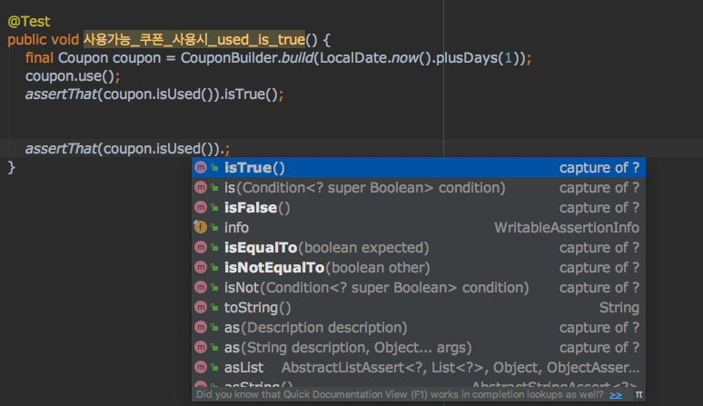
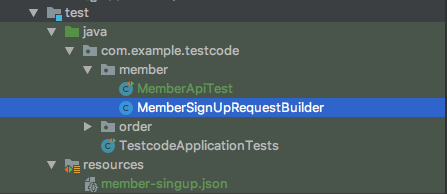

# 테스트 코드에 대한 나름의 고찰

스프링 기반으로 많은 테스트코드를 작성하면서 느꼈던 나름의 고찰과 어려움을 정리하는 포스팅을 입니다. 사실은 테스트 코드 작성의 나름의 결론을 내려고 포스팅하려고 했지만 많은 고민들이 있었고 이 고민에 대한 마땅한 해답이 없어서 테스트 코드에 대한 나름의 고찰을 정리해보았습니다.

## 테스트 코드의 필요성

* 피드백을 빨리준다.
* 코드 뽕에 취한다.
* 그 자체가 문서가 된다.
* 커뮤니케이션이 좋다


## POJO 테스트는 언제 나 옳다.
이전에 포스팅한 [Test 전략 가이드](https://github.com/cheese10yun/spring-guide/blob/master/docs/test-guide.md), [Spring Boot 테스틑 종류](https://github.com/cheese10yun/spring-guide/blob/master/docs/test-guide.md)에서 처럼 스프링에서는 매우 다양한 테스트 방법을 제공해주고 있습니다. 이런 Slice 테스트 지원으로 테스트 하고 싶은 레이어를 부분적으로 빠르게 테스트 할 수 있습니다. 

**이런 강력한 기능들 때문에 POJO에 대한 테스팅은 상대적으로 덜 중요하게 여겨지다 보니 POJO 테스트 코드 작성도 등한시하게 되는거 같습니다.**

POJO 테스트의 장점
* POJO 객체를 테스트하는 것이라서 빠르다.
* 디펜던시가 상대적으로 적어서 테스트 코드 작성이 편하다.
* 단위 테스트 하기 가장 이상적이다.

POJO 테스트의 대표적인 항목들은 Util 객체, Domain 객체 등이 있습니다. **특히 ORM을 사용하고 있다면 도메인 객체들의 테서트 코드는 해당 프로젝트의 도메인 지식을 설명해주는 아주 좋은 문서 역활을 대신 해줍니다.**


```java
public class CouponTest {

    @Test(expected = CouponExpireException.class)
    public void 만료일이지난_쿠폰_사용_불가() {
        final Coupon coupon = CouponBuilder.build(LocalDate.now().minusDays(1));
        coupon.use();
    }

    @Test(expected = CouponAlreadyUseException.class)
    public void 이미_사용한_쿠폰은_쿠폰_사용_불가() {
        final Coupon coupon = CouponBuilder.build(LocalDate.now().plusDays(3));
        coupon.use();

        // 이미 사용한 쿠폰을 다시 한번 사용했을 다시 사용
        coupon.use();
    }

    @Test
    public void 사용가능_쿠폰_사용시_used_is_true() {
        final Coupon coupon = CouponBuilder.build(LocalDate.now().plusDays(1));
        coupon.use();
        assertThat(coupon.isUsed()).isTrue();
    }
}
```
쿠폰 테스트 코드를 통해서 해당 쿠폰 도메인의 비지니스 요구사항을 설명해주는 도큐먼트로 볼수 있습니다.


## Matchers는 AssertJ 가 좋다.


위 그림은 assertThat은 `import static org.junit.Assert.assertThat;` 에서 가져온 assertThat이다. 해당 Matchers는 자동완성 기능을 제공해주지 않아 무슨 메서드가 있는지 일단 외우고 있어야한다. 다른 메처들은 어느정도 추천 자동 완성 기능을 재공해주고 있지만 매게변수로 넘기는 방식이다.

반면 `AssertJ`는 사용법은 매게변수를 넘기는 것이아니다.


` assertThat(coupon.isUsed())` 코드뒤에 `.`을 붙여 사용하는 방식이라서 해당 함수가 무엇이 있는지 명확하게 알려준다. 그리고 AssertJ 재공해주는 함수들이 메우 테스틏하기 친절한 함수들이 많다. **JUnit을 사용하고 있다면 Matchers는 AssertJ를 적극 추천한다.**


## 테스트만을 위한 코드

테스트 코드작성만을 위해서 필요한 코드를 만들어야 할 떄가 간혹있습니다. 우선 테스트를 진행하기 위해서 코드가 들어간다는 거 자체가 매우 부정적입니다.


```java
public class MemberApi {

  private final MemberRepository memberRepository;

  @PostMapping
  public Member create(@RequestBody MemberSingUpRequest dto) {
    return memberRepository.save(new Member(dto.getEmail(), dto.getName()));
  }
}

public class MemberSingUpRequest {

  @NotEmpty private String name;

  @Email private String email;
}

```

위와 같은 API가 있을 경우 테스트 코드를 작성할 수 있습니다.


```java
@SpringBootTest
@RunWith(SpringRunner.class)
@AutoConfigureMockMvc
public class MemberApiTest {

  @Autowired
  private MockMvc mvc;

  @Autowired
  protected ObjectMapper objectMapper;

  @Test
  public void 회원가입테스트() throws Exception {

    //given
    final MemberSingUpRequest dto = new MemberSingUpRequest("yun", "yun@asd.com");

    //when
    final ResultActions resultActions = mvc.perform(post("/members")
        .contentType(MediaType.APPLICATION_JSON_UTF8)
        .content(objectMapper.writeValueAsString(dto)))
        .andDo(print());

    //then
    resultActions
        .andExpect(status().isOk());

  }
}
```

여기서 중요한 것은 givne 절에서 Request Body가 받을 DTO를 만들어야 하는 점인데. 실제 값바인딩은 리플랙션 기반으로 처리되니 별다른 생성자를 만들필요가 없습니다.

하지만 테스트 코드에서는 json 값을 넘겨줘야 하기 때문에 테스코드 작성을 위헤서 아래와 같은생성자를 만들어야 합니다.

```java
public MemberSingUpRequest(final String name, final String email) {
    this.name = name;
    this.email = email;
  }
```

Validation을 어노테이션들이 동작하지 않는다. 내가 의도하지 않은 객체 생성이 이루어지는 가능성이 있고 무엇보다 해당 코드는 테스트 코드에서만 사용되는 코드입니다.

### JSON 기반으로 테스트

```json
{
  "name": "yun",
  "email": "yun@asd.com"
}
```

```java
...
public class MemberApiTest {

    ...

    @Test
  public void json_파일로테스트() throws Exception {
    //given
    final String requestBody = readJson("classpath:member-singup.json");

    //when
    final ResultActions resultActions = mvc.perform(post("/members")
        .contentType(MediaType.APPLICATION_JSON_UTF8)
        .content(requestBody))
        .andDo(print());

    //then
    resultActions
        .andExpect(status().isOk());

  }
}
```
json 파일을 읽어 들여 String 으로 값을 전달하게 되면 위에서 작성한 생성자 코드를 사용하지 않아도됩니다. 

```json
{
  "orderer": {
    "name": "yun",
    "email": "yun@asd.com"
  },
  "product": [
    {
      "name": "양말",
      "price": 123233
    },
    {
      "name": "바자",
      "price": 1000
    },
    {
      "name": "치마",
      "price": 1120
    }
  ],
  "coupon": {
    "code": "xx2sd292kd"
  },
  "address": {
    "address1": "서울블라브라..."
    "address2": "어디 동...",
    "zip": "123-2332"
  }
}
```

특히 위 처럼 json이 복잡한 경우에는 객체기반으로 생성하는 것이 많이 번거롭습니다. 이런 경우에는 json으로 관리하는 것이 효율적일 수 있습니다.

단점도 있습니다. 유효성검사등 다양한 값을 넣기 위해서는 그 만큼 json 파일을 만들어야 하는 단점도 있습니다. 객체 생성으로 만들면 파라미터를 통해서 값만 변경할 수 있지만 json 파일로 만들게 되는 경우는 여러 json 만들어서 테스트 해야합니다.


### Default 접근지시자를 통한 객체 생성
Default 접근지시자를 사용하면 동일 패키지 내에서는 접근할 수 가 있습니다. 


```java
@NoArgsConstructor(access = AccessLevel.PRIVATE)
@Getter
public class MemberSingUpRequest {

  @NotEmpty
  private String name;

  @Email
  private String email;

  MemberSingUpRequest(final String name, final String email) {
    this.name = name;
    this.email = email;
  }
}

// 해당 클래스는 test 디렉토리에 위치합니다.
public class MemberSignUpRequestBuilder {

  public static MemberSingUpRequest build(String name, String email) {
    return new MemberSingUpRequest(name, email);
  }
}
```


`test` 디렉토리에 경로가 동일하다면 `Default` 접근지시자로 되있는 생성자로 접근이 가능합니다. 

```java
@Test
  public void default_접근지시자_를이용한_테스트() throws Exception {
    //given
    final MemberSingUpRequest dto = MemberSignUpRequestBuilder.build("yun", "yun@asd.com");

    //when
    final ResultActions resultActions = mvc.perform(post("/members")
        .contentType(MediaType.APPLICATION_JSON_UTF8)
        .content(objectMapper.writeValueAsString(dto)))
        .andDo(print());

    //then
    resultActions
        .andExpect(status().isOk());

  }
```
이런식으로 테스트를 진행하면 동일 패키지에서 밖에 접근하지 못하는 코드임으로 테스트 코드만을 위한 코드이지만 영향을 최소한으로 할 수 있습니다. 

주의해야할 점은 생성자가 추가됬기 때문에 반드시 기본 생성자를 하나 만들어야 합니다. 이때 접근지시자는 `private` 접근지시자를 통해서 최소한으로 만들어 줍니다. **항상 접근지시자는 되도록 낮은것을 사용하는 습관을 갖는 것이 좋습니다.**

settet를 추가하는 방법도 있겠지만 settet는 Request, Response 객체같은 경우에는 최대한 지양하는 것이 좋습니다.

이런 방식은 코드량이 많기도하고 애초에 default 생성자라도 있는 것이기 때문에 그다지 설득력이 크게 있지는 않아 최근에는 그냥 public 생성자를 통해서 생성하고 있습니다.


## Setter의 유혹
[step-06: Setter 사용하지 않기](https://github.com/cheese10yun/spring-jpa-best-practices/blob/master/doc/step-06.md) 및 많은 포스팅에서 setter 메서드를 지양해야 한다고 말해왔습니다. 하지만 테스트 코드 작성시 setter 메서드의 
필요성이 절실할 경우가 많습니다.


